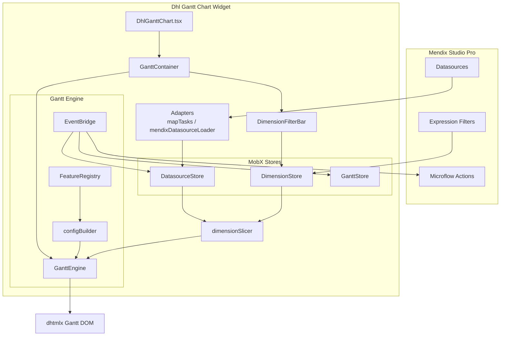

# 2. Architecture

## Tổng quan kiến trúc

Widget tuân theo mô hình **Multiple Dimensions**: dữ liệu được chuẩn hóa, lọc theo dimension, rồi render qua dhtmlx adapter.



## Data flow

```
Mendix entities / Mock JSON
        ↓
  Adapters (mapTasks, mendixDatasourceLoader)
        ↓
  GanttNormalizedModel  ← canonical model
        ↓
  DimensionStore.getSlicedModel()  ← client filter
        ↓
  mapModelToDhtmlx()
        ↓
  GanttEngine.parse()
        ↓
  dhtmlx Gantt render
```

### Canonical model (`GanttNormalizedModel`)

```typescript
interface GanttNormalizedModel {
  tasks: GanttTask[];
  links: GanttLink[];
  resources: GanttResource[];
  assignments: GanttAssignment[];
}
```

Mọi nguồn dữ liệu (mock hoặc Mendix) đều được map về cấu trúc này trước khi render. Chi tiết field: [data-model.md](../specs/001-dhl-gantt-chart/data-model.md).

## MobX stores

### DatasourceStore

| Trách nhiệm | Chi tiết |
|-------------|----------|
| Giữ model | `GanttNormalizedModel` sau load |
| Loading state | `isLoading`, `error`, `lastLoadedAt` |
| Detail dialog | `openDetailDialog`, `closeDetailDialog` |
| Edit buffer | `updateTask`, `addLink`, `removeLink` |
| Action context | `setLastActionContext` — truyền sang Mendix action |

**Load paths:**
- Mock: `loadMockDatasource()` → `getMultiSiteScenario()` / empty / performance
- Mendix: `loadFromMendix(props)` → `mendixDatasourceLoader`

### DimensionStore

| Trách nhiệm | Chi tiết |
|-------------|----------|
| Filter axes | site, sourceSystem, department, status, project, time |
| Week selection | `selectWeek(from, to)` |
| Product segment | `selectProjectSegment(taskId)` |
| Slice | `getSlicedModel(model)` → debounced 300ms |
| Cross-filter | `crossFilterMode`: `and` \| `or` |

### GanttStore

| Trách nhiệm | Chi tiết |
|-------------|----------|
| View state | scale, scrollDate, selectedTaskIds |
| Edit snapshots | `saveTaskSnapshot` / rollback support |
| UI messages | toast errors (conflict, link circular, save fail) |

## GanttEngine

Wrapper quanh singleton `dhtmlx-gantt`:

| Method | Mục đích |
|--------|----------|
| `init(container, features, options)` | Khởi tạo DOM — **chỉ khi container mounted và không loading** |
| `parse(model, options)` | Parse sliced model vào chart |
| `setScale(scale)` | Đổi scale; week → executive timeline |
| `scrollToDate(date)` | Scroll timeline tới ngày |
| `rollbackTask(task)` | Khôi phục task sau edit fail |
| `destroy()` | Cleanup khi unmount |

**Deferred init:** `useGanttLifecycle` đợi `isLoading=false` trước khi `init`, tránh lỗi render dhtmlx trên container rỗng.

## EventBridge

Map dhtmlx events → MobX actions → Mendix microflows:

| dhtmlx Event | Handler |
|--------------|---------|
| `onTaskClick` | Select + detail dialog (chỉ task bar) |
| `onBeforeTaskDrag` | Permission + snapshot |
| `onAfterTaskUpdate` | Commit hoặc rollback |
| `onBeforeLinkAdd` | Validation |
| `onCircularLinkError` | Error toast E002 |

**Task bar click detection:** chỉ mở dialog khi click vào `.gantt_task_line`, `.gantt_task_content`, hoặc `.gantt_milestone` — không mở khi click grid row.

## FeatureRegistry

Centralized feature flags từ widget properties. `readOnly=true` force-disable mọi edit flag.

```typescript
// Ví dụ flags
showGrid, showChart, enableDragMove, enableResize,
enableLinkDraw, autoScheduling, enableUndo, enableExport, ...
```

PRO features kiểm tra `licenseKey` qua `isProFeatureEnabled()`.

## Executive timeline module

File: `src/engine/executiveTimeline.ts`

Kích hoạt khi `initialScale === "week"`:

| Thành phần | Hành vi |
|------------|---------|
| Top scale | `Phase I · 2026` / `Phase II · 2026` (6 tháng/step) |
| Bottom scale | `T1`, `T2`, … (ISO week từ anchor year) |
| Grid columns | Portfolio / Product (tree), Week, % |
| Row/bar CSS | Class theo `custom.level`: company, program, product, milestone |
| Task text | Ẩn label trên bar company/program; hiện trên product |

Anchor year: `EXECUTIVE_TIMELINE_ANCHOR_YEAR = 2026`.

## Component tree

```
DhlGanttChart (StoreProvider)
└── WidgetErrorBoundary
    └── GanttContainer
        ├── TrialNoticeBanner
        ├── DimensionFilterBar
        ├── LoadingOverlay
        ├── GanttEmptyState
        ├── [gantt container div]
        ├── DetailDialog
        └── GanttErrorToast
```

## File map

| Path | Vai trò |
|------|---------|
| `src/DhlGanttChart.tsx` | Entry, props → stores |
| `src/DhlGanttChart.xml` | Mendix property schema |
| `src/components/GanttContainer.tsx` | Orchestration, lifecycle |
| `src/components/DimensionFilterBar.tsx` | Week + product UI |
| `src/engine/GanttEngine.ts` | dhtmlx wrapper |
| `src/engine/configBuilder.ts` | Scale, columns, plugins |
| `src/engine/eventBridge.ts` | Event → action mapping |
| `src/engine/executiveTimeline.ts` | Executive scales/grid |
| `src/dimensions/weekTimeline.ts` | Week buckets, segments |
| `src/dimensions/dimensionSlicer.ts` | Client-side filter engine |
| `src/adapters/mendixDatasourceLoader.ts` | Mendix → canonical |
| `src/adapters/mapTasks.ts` | Canonical → dhtmlx |
| `src/mock/datasources/` | Mock data scenarios |
