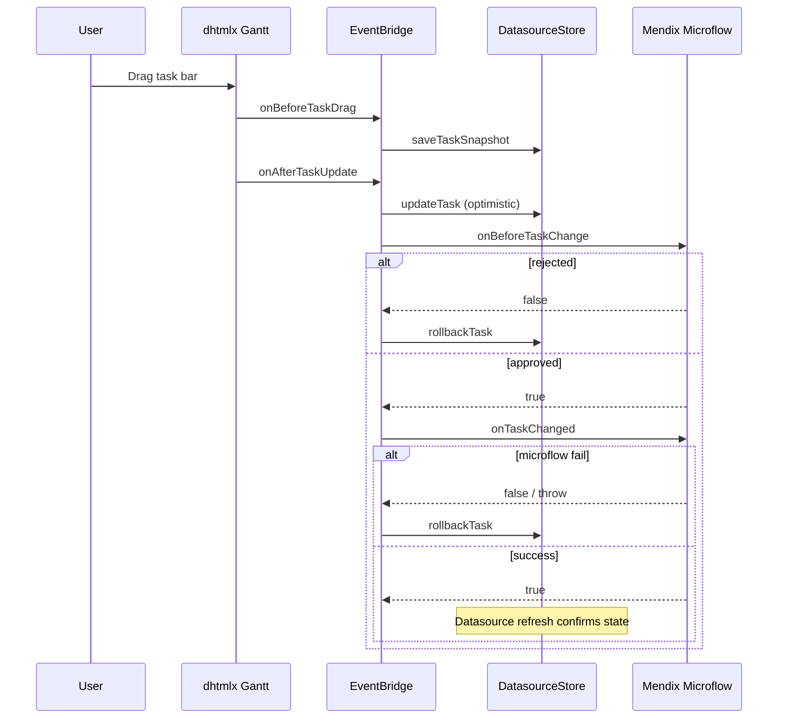

# 5. Mendix Integration

## Tổng quan

Production mode: `useMockData = false`. Widget đọc Mendix datasource lists, map sang canonical model, render chart. Edits trigger Mendix actions để persist.

## Domain model khuyến nghị

### Task entity

| Attribute | Type | Widget mapping |
|-----------|------|----------------|
| TaskId | String / AutoNumber | `taskId` |
| Label | String | `taskLabel` |
| StartDate | DateTime | `taskStart` |
| EndDate | DateTime | `taskEnd` |
| Duration | Integer | `taskDuration` |
| ParentTaskId | String | `taskParentId` |
| Progress | Decimal | `taskProgress` (0..1) |
| TaskType | Enum | `taskType` |
| IsOpen | Boolean | `taskOpen` |
| ReadOnly | Boolean | `taskReadOnly` |
| Color | String | `taskColor` |
| SiteCode | String/Enum | `taskSiteCode` |
| SourceSystem | Enum | `taskSourceSystem` |
| Status | Enum | `taskStatus` |
| Version | Integer | `taskVersion` |
| ModifiedAt | DateTime | `taskModifiedAt` |

### Link entity

| Attribute | Mapping |
|-----------|---------|
| LinkId | `linkId` |
| SourceTaskId | `linkSource` |
| TargetTaskId | `linkTarget` |
| LinkType | `linkType` (0–3) |
| Lag | `linkLag` |

### Resource entity

| Attribute | Mapping |
|-----------|---------|
| ResourceId | `resourceId` |
| Name | `resourceName` |
| Type | `resourceType` |
| SiteCode | `resourceSiteCode` |
| Department | `resourceDepartment` |
| Capacity | `resourceCapacity` |

### Assignment entity

| Attribute | Mapping |
|-----------|---------|
| AssignmentId | `assignmentId` |
| TaskId | `assignmentTaskId` |
| ResourceId | `assignmentResourceId` |
| Value | `assignmentValue` |
| Start / End | `assignmentStart` / `assignmentEnd` |

## Page setup

### 1. Datasource microflow / XPath

Tạo page với DataView hoặc ListView datasource trả về tasks. Widget nhận `tasksDataSource` là list of objects.

```text
[Retrieve Task list where Site = $CurrentSite]
  → pass to widget tasksDataSource
```

### 2. Required mappings

Studio Pro widget properties:
- **Tasks datasource** → Task list
- **Task ID** → TaskId
- **Task label** → Label
- **Task start** → StartDate

### 3. Optional datasources

Links, Resources, Assignments — configure tương tự khi cần dependency lines hoặc resource view.

## Loader pipeline

File: `src/adapters/mendixDatasourceLoader.ts`

```
For each ObjectItem in datasource:
  readStringAttribute / readDateAttribute / readNumberAttribute
  → validate (E001–E005, W101–W104)
  → GanttTask | null

Aggregate → GanttNormalizedModel
Issues → onDataParseError (errors) + console (debugMode)
```

### Parse rules

| Rule | Code | Hành vi |
|------|------|---------|
| Duplicate task ID | E001 | Skip duplicate |
| Link missing task | E002 | Skip link |
| Assignment missing ref | E003 | Skip assignment |
| Circular parent | E004 | Flatten to root |
| End before start | E005 | Skip task |
| Missing end+duration | W101 | Skip task |
| Progress out of range | W103 | Clamp 0..1 |

## Edit persistence flow



### Optimistic concurrency

Map `taskVersion` từ entity. Trước commit:

```typescript
if (snapshot.version !== storeTask.version) {
  // CONFLICT — reject edit, show toast
}
```

Microflow `onTaskChanged` nên increment version và update `ModifiedAt`.

## Context entity (NPE)

Tạo non-persistent entity `GanttTaskContext` với attributes khớp [TaskEventContext](../specs/001-dhl-gantt-chart/contracts/mendix-action-context.md):

- TaskId, TaskLabel, SiteCode, SourceSystem
- Start, End, Progress
- ChangeType, PreviousStart, PreviousEnd (cho edit actions)

Microflow đọc context từ `$GanttTaskContext` object tạo bởi widget trước `execute()`.

## Expression filters

Bind page parameters vào widget expressions:

```text
filterSiteCodes = $CurrentUser/SiteCode
filterDateFrom = $PlanningPeriod/StartDate
filterDateTo = $PlanningPeriod/EndDate
```

Widget apply filters vào DimensionStore on prop change.

## Resource timeline mode

Requirements:
- `viewMode = resourceTimeline` hoặc `hybrid`
- `resourcesDataSource` configured (S002 validation)
- `assignmentsDataSource` recommended

Over-allocation: cells vượt `resourceCapacity` được highlight (CSS class từ template).

## Refresh strategies

| Strategy | Config |
|----------|--------|
| Manual | Default — refresh page hoặc datasource |
| Polling | `refreshInterval > 0` (seconds) |
| After edit | `onTaskChanged` microflow commit + refresh datasource |
| Server filter | `filterMode = server` — Mendix XPath pre-filters list |

## needsEntityContext

Widget XML: `needsEntityContext="false"` — widget không yêu cầu page context entity; datasources truyền qua props.

## Import widget

1. `pnpm run build`
2. Import `dist/1.0.0/mendix.DhlGanttChart.mpk` vào Mendix project
3. Hoặc set `projectPath` trong `package.json` và dùng `pnpm run dev` sync

```json
"config": {
  "projectPath": "/path/to/mendix/project"
}
```
