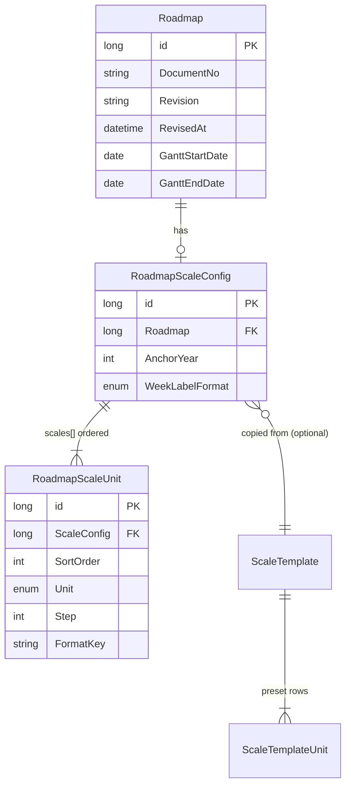

# 10. Oracle DB & Mendix Domain — scaleJson

Thiết kế lưu trữ **scaleJson** (và timeline bounds liên quan) trên Oracle, map vào Mendix domain model, aggregate ra JSON cho widget AxGantt.

**DDL tham chiếu:** [`docs/sql/oracle-axgantt-scale.sql`](sql/oracle-axgantt-scale.sql)

---

## 1. ER diagram



---

## 2. Bảng Oracle (tên ngắn)

| Bảng | Ý nghĩa | Mendix entity |
|------|---------|---------------|
| `pm_roadmap` | Roadmap + timeline bounds | `Roadmap` |
| `pm_scale` | scaleJson root (anchorYear, weekFmt) | `RoadmapScaleConfig` |
| `pm_scale_row` | scaleJson.scales[] (hàng năm/tuần) | `RoadmapScaleUnit` |
| `pm_scale_tpl` | Preset scale (admin) | `ScaleTemplate` |
| `pm_scale_tpl_row` | Dòng preset | `ScaleTemplateUnit` |
| `v_pm_scale_json` | View aggregate JSON | — |

Prefix `pm_` = PM Roadmap module. Cột cũng rút gọn: `doc_no`, `gantt_start`, `anchor_year`, `week_fmt`, `sort_no`, `step_val`, `fmt_key`.

## 3. Map JSON → bảng

| scaleJson field | Mendix entity | Oracle (bảng.cột) | Ghi chú |
|-----------------|---------------|-------------------|---------|
| *(widget prop)* | `Roadmap.GanttStartDate` | `pm_roadmap.gantt_start` | Không nằm trong scaleJson |
| *(widget prop)* | `Roadmap.GanttEndDate` | `pm_roadmap.gantt_end` | Clip cột tuần hiển thị |
| `anchorYear` | `RoadmapScaleConfig.AnchorYear` | `pm_scale.anchor_year` | Default 2026; 2026 = 53 ISO weeks |
| `weekLabelFormat` | `RoadmapScaleConfig.WeekLabelFormat` | `pm_scale.week_fmt` | Enum `W##` \| `T##` |
| `scales[n].unit` | `RoadmapScaleUnit.Unit` | `pm_scale_row.unit` | `year` \| `month` \| `week` \| `day` |
| `scales[n].step` | `RoadmapScaleUnit.Step` | `pm_scale_row.step_val` | Default 1 |
| `scales[n].format` | `RoadmapScaleUnit.FormatKey` | `pm_scale_row.fmt_key` | `year`, `W##`, … |
| Thứ tự mảng | `RoadmapScaleUnit.SortOrder` | `pm_scale_row.sort_no` | **0 = hàng trên** (năm), 1 = tuần |

**Output JSON mục tiêu** (mock):

```json
{
  "anchorYear": 2026,
  "weekLabelFormat": "W##",
  "scales": [
    { "unit": "year", "step": 1, "format": "year" },
    { "unit": "week", "step": 1, "format": "W##" }
  ]
}
```

Widget hiển thị hàng tuần là **Tuần 01, Tuần 02…** (format `W##` trong `scaleBuilder.ts`).

---

## 4. Mendix domain model (Studio Pro)

**Module:** `PMRoadmap`

### 4.1 Enumerations

| Enum | Values | Dùng cho |
|------|--------|----------|
| `WeekLabelFormat` | `W_SharpSharp` (= `W##`), `T_SharpSharp` (= `T##`) | `RoadmapScaleConfig`, `ScaleTemplate` |
| `ScaleUnitType` | `Year`, `Month`, `Week`, `Day` | `RoadmapScaleUnit`, `ScaleTemplateUnit` |

> Trong microflow/Java: map enum → string JSON (`W_SharpSharp` → `'W##'`).

### 4.2 Entity: `Roadmap` (mở rộng)

| Attribute | Type | Required | Widget |
|-----------|------|----------|--------|
| `DocumentNo` | String (64) | ✅ | `roadmapNo` |
| `Revision` | String (16) | ❌ | `roadmapRevision` |
| `RevisedBy` | String (128) | ❌ | `roadmapRevisedBy` |
| `RevisedAt` | DateTime | ❌ | `roadmapRevisedAt` |
| **`GanttStartDate`** | Date | ✅ | `ganttStartDate` |
| **`GanttEndDate`** | Date | ✅ | `ganttEndDate` |
| `IsActive` | Boolean | ✅ | — |

Association: `Roadmap [1] — [0..1] RoadmapScaleConfig` (owner: ScaleConfig)

### 4.3 Entity: `RoadmapScaleConfig`

| Attribute | Type | Required | Default |
|-----------|------|----------|---------|
| `AnchorYear` | Integer | ✅ | `2026` |
| `WeekLabelFormat` | Enum | ✅ | `W_SharpSharp` |
| `Name` | String | ❌ | — |
| `Description` | String (unlimited) | ❌ | — |

Associations:
- `RoadmapScaleConfig_Roadmap` → Roadmap (1:1)
- `RoadmapScaleConfig_ScaleTemplate` → ScaleTemplate (optional, many ScaleConfig → one Template)

**Validation microflow:**
- `AnchorYear` between 1970 and 2100
- Nếu không có `RoadmapScaleUnit` → widget dùng default year+week

### 4.4 Entity: `RoadmapScaleUnit`

| Attribute | Type | Required | Default |
|-----------|------|----------|---------|
| `SortOrder` | Integer | ✅ | — |
| `Unit` | Enum `ScaleUnitType` | ✅ | — |
| `Step` | Integer | ✅ | `1` |
| `FormatKey` | String (32) | ✅ | — |

Association: `RoadmapScaleUnit_ScaleConfig` → RoadmapScaleConfig (many-to-one, **SortOrder** unique per config)

**Ràng buộc nghiệp vụ (Change microflow):**

| Unit | FormatKey hợp lệ |
|------|------------------|
| Year | `year`, `YYYY` |
| Week | `W##`, `T##` |
| Month | `month`, `MMM YYYY`, `MM/YYYY` |
| Day | `day`, `dd MMM`, `DD/MM` |

**Preset khuyến nghị (executive roadmap):**

| SortOrder | Unit | Step | FormatKey |
|-----------|------|------|-----------|
| 0 | Year | 1 | `year` |
| 1 | Week | 1 | `W##` |

### 4.5 Entity: `ScaleTemplate` (optional — admin preset)

| Attribute | Type |
|-----------|------|
| `TemplateCode` | String (32), unique |
| `TemplateName` | String (128) |
| `AnchorYear` | Integer |
| `WeekLabelFormat` | Enum |
| `IsDefault` | Boolean |
| `IsActive` | Boolean |

Association: `ScaleTemplateUnit` (1 — *) giống `RoadmapScaleUnit`.

Microflow **ApplyTemplateToRoadmap**: copy rows từ template sang `RoadmapScaleUnit`.

---

## 5. Mendix deploy vs DDL tham chiếu

Mendix tự sinh bảng dạng `pmroadmap$roadmap`, `pmroadmap$roadmapscaleconfig`, … File [`oracle-axgantt-scale.sql`](sql/oracle-axgantt-scale.sql) dùng tên **ngắn** (`pm_*`) cho DBA/review — map logic entity giữ nguyên.

| Mendix entity | Mendix table (deploy) | DDL tham chiếu |
|---------------|----------------------|----------------|
| `Roadmap` | `pmroadmap$roadmap` | `pm_roadmap` |
| `RoadmapScaleConfig` | `pmroadmap$roadmapscaleconfig` | `pm_scale` |
| `RoadmapScaleUnit` | `pmroadmap$roadmapscaleunit` | `pm_scale_row` |
| `ScaleTemplate` | `pmroadmap$scaletemplate` | `pm_scale_tpl` |
| `ScaleTemplateUnit` | `pmroadmap$scaletemplateunit` | `pm_scale_tpl_row` |

Index khuyến nghị trên Mendix table:

```sql
CREATE UNIQUE INDEX uk_scale_row_order
    ON pmroadmap$roadmapscaleunit (pmroadmap$roadmapscaleconfigid, sortorder);
```

---

## 6. Microflow `MF_BuildScaleJson`

**Input:** `Roadmap`  
**Output:** `String` (JSON)

```
1. Retrieve RoadmapScaleConfig WHERE RoadmapScaleConfig/Roadmap = $Roadmap
   (không có → return '{}' hoặc default JSON cứng)

2. Retrieve list RoadmapScaleUnit WHERE ScaleConfig = $Config
   SORT BY SortOrder ASC

3. Loop units → List of JSON objects:
   { "unit": toLower($Unit/Unit), "step": $Unit/Step, "format": $Unit/FormatKey }

4. Build root (Java action hoặc String concat):
   {
     "anchorYear": $Config/AnchorYear,
     "weekLabelFormat": mapWeekLabelFormat($Config/WeekLabelFormat),
     "scales": [ ... ]
   }

5. Return JSON string
```

**Map enum → JSON string:**

| Mendix enum | JSON |
|-------------|------|
| `W_SharpSharp` | `W##` |
| `T_SharpSharp` | `T##` |
| `Year` | `year` |
| `Week` | `week` |

### Java action gợi ý (tùy chọn)

```java
// IMendixObject config, List<IMendixObject> units
JSONObject root = new JSONObject();
root.put("anchorYear", config.getValue(context, "AnchorYear"));
root.put("weekLabelFormat", mapWeekFormat(config.getValue(context, "WeekLabelFormat")));
JSONArray scales = new JSONArray();
for (IMendixObject u : units) {
    JSONObject row = new JSONObject();
    row.put("unit", mapUnit(u.getValue(context, "Unit")));
    row.put("step", u.getValue(context, "Step"));
    row.put("format", u.getValue(context, "FormatKey"));
    scales.put(row);
}
root.put("scales", scales);
return root.toString();
```

---

## 7. Wiring widget (cùng Roadmap)

```
roadmapNo        = $Roadmap/DocumentNo
roadmapRevision  = $Roadmap/Revision
roadmapRevisedBy = $Roadmap/RevisedBy
roadmapRevisedAt = $Roadmap/RevisedAt
ganttStartDate   = $Roadmap/GanttStartDate
ganttEndDate     = $Roadmap/GanttEndDate
scaleJson        = MF_BuildScaleJson($Roadmap)
taskListJson     = MF_BuildTaskListJson($Roadmap)
```

---

## 8. Seed data (mock 2025–2028)

| Roadmap | GanttStart | GanttEnd | AnchorYear | Scales |
|---------|------------|----------|------------|--------|
| Msoc251030-155 rev 3 | 2025-01-01 | 2028-12-31 | 2026 | year + W## |

SQL seed đầy đủ (ID Mendix cố định): [`oracle-axgantt-scale-seed.sql`](sql/oracle-axgantt-scale-seed.sql).

---

## 9. Query kiểm tra (Oracle view)

```sql
SELECT roadmap_id, doc_no, scale_json
FROM v_pm_scale_json
WHERE doc_no = 'Msoc251030-155';
```

Kết quả:

```json
{"anchorYear":2026,"weekLabelFormat":"W##","scales":[{"unit":"year","step":1,"format":"year"},{"unit":"week","step":1,"format":"W##"}]}
```

---

## 10. Checklist triển khai Mendix

1. Tạo enumerations `WeekLabelFormat`, `ScaleUnitType`
2. Mở rộng `Roadmap`: thêm `GanttStartDate`, `GanttEndDate`
3. Tạo `RoadmapScaleConfig` (1:1 với Roadmap)
4. Tạo `RoadmapScaleUnit` (SortOrder, Unit, Step, FormatKey)
5. (Optional) `ScaleTemplate` + `ScaleTemplateUnit` + Apply microflow
6. Implement `MF_BuildScaleJson`
7. Trang Gantt: bind `scaleJson`, `ganttStartDate`, `ganttEndDate`
8. Deploy DB → verify index unique `(ScaleConfig, SortOrder)`
