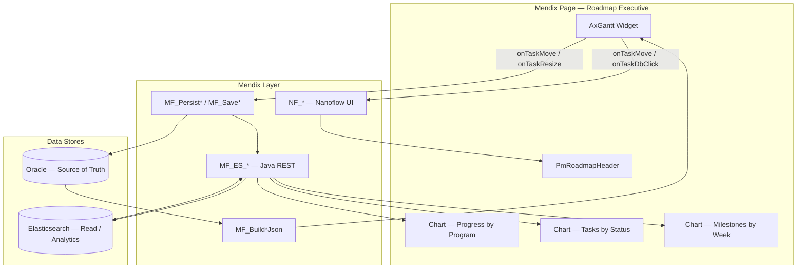
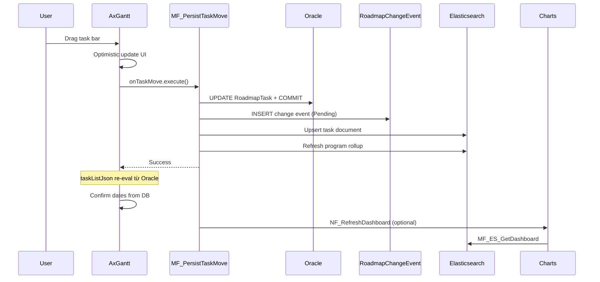

# 11. Microflow, Nanoflow & Elasticsearch

Hướng dẫn thiết kế **microflow / nanoflow** cho trang **AxGantt** (biểu đồ Gantt phía trên) và **Elasticsearch** cho lớp đọc / biểu đồ tổng hợp phía dưới.

**Liên quan:** [05-mendix-integration](./05-mendix-integration.md) · [07-events-and-actions](./07-events-and-actions.md) · [10-oracle-scale-domain](./10-oracle-scale-domain.md)

---

## 1. Kiến trúc tổng thể



### Nguyên tắc phân tầng

| Tầng | Vai trò | Công nghệ |
|------|---------|-----------|
| **Gantt (trên)** | Lịch chi tiết 5 cấp, drag/resize, milestone | Oracle → JSON expression → AxGantt |
| **Dashboard (dưới)** | Tổng hợp, KPI, filter nhanh, search | Elasticsearch aggregations |
| **Ghi** | Luôn qua microflow → Oracle trước | ACID, audit, optimistic lock |
| **Đọc tổng hợp** | Query ES (eventual consistency) | Sub-second aggregate |

> **Quan trọng:** Sau mỗi lần ghi, **Gantt refresh từ Oracle** (`taskListJson` re-evaluate). **Chart refresh từ ES** (async hoặc gọi ngay sau upsert). Không đọc chart trực tiếp từ Oracle nếu query nặng.

---

## 2. Microflow vs Nanoflow — khi nào dùng gì?

| Tiêu chí | Microflow | Nanoflow |
|----------|-----------|----------|
| Chạy trên server | ✅ | ❌ (client) |
| Commit DB / Oracle | ✅ | ❌ |
| Gọi Elasticsearch REST | ✅ (Java action) | ❌ (trừ qua Call microflow) |
| Mở page / popup | ✅ | ✅ (ưu tiên) |
| Set biến trang nhanh | Có thể | ✅ (ưu tiên) |
| Rollback widget (write action) | ✅ — throw = rollback | Không dùng cho persist |

**Quy tắc cho AxGantt:**

| Hành vi | Handler |
|---------|---------|
| Build JSON (`taskListJson`, `scaleJson`, …) | **Microflow** |
| Persist drag/resize/create | **Microflow** |
| Double-click mở detail | **Nanoflow** |
| Chọn task → highlight chart | **Nanoflow** |
| Refresh dashboard sau save | **Nanoflow** gọi `MF_ES_GetDashboard` |
| Reindex ES ban đêm | **Microflow** (scheduled) |

---

## 3. Domain bổ sung (NPE + Event)

Ngoài `Roadmap`, `RoadmapTask`, `RoadmapScaleConfig` (xem doc 10):

### 3.1 NPE `GanttActionContext` (bắt buộc cho action wiring)

Widget set context trong JS (`TaskEventContext` / `TaskChangeContext`) **trước** `action.execute()`. Mendix microflow **không đọc được JS store** — cần bridge qua NPE trên page.

| Attribute | Type | Map từ widget |
|-----------|------|---------------|
| `TaskId` | String | `taskId` |
| `TaskLabel` | String | `taskLabel` |
| `Start` | DateTime | parse `start` ISO |
| `End` | DateTime | parse `end` ISO |
| `Progress` | Decimal | `progress` |
| `ParentId` | String | `parentId` |
| `Level` | String | `level` |
| `ChangeType` | Enum | move / resize / create / rowDrag |
| `PreviousStart` | DateTime | `previousStart` |
| `PreviousEnd` | DateTime | `previousEnd` |
| `Cancelled` | Boolean | `cancelled` |

**Page entity:** `RoadmapPageContext` (NPE, 1 record/page)

Association: `RoadmapPageContext [1] — [1] Roadmap`

**Bridge pattern (triển khai):**

1. **Khuyến nghị ngắn hạn:** Java action `JA_ApplyGanttActionContext` nhận JSON string, map vào `$GanttActionContext` — gọi ở đầu mỗi MF persist/select.
2. **Khuyến nghị dài hạn:** Mở rộng widget — thêm property `actionContext` (Object) ghi vào NPE trước `execute()` (Mendix ObjectReference / EditableValue).

Microflow wrapper cho mọi write action:

```
MF_PersistTaskMove_Wrapper
  1. JA_ApplyGanttActionContext($GanttActionContext, $ContextJsonFromPage)
  2. Call MF_PersistTaskMove($Roadmap, $GanttActionContext)
```

### 3.2 Entity `RoadmapChangeEvent` (audit + ES pipeline)

| Attribute | Type |
|-----------|------|
| `EventId` | String (UUID) |
| `Roadmap` | Association |
| `TaskKey` | String |
| `ChangeType` | Enum |
| `PayloadJson` | String (unlimited) |
| `OccurredAt` | DateTime |
| `UserName` | String |
| `EsSyncStatus` | Enum: Pending / Synced / Failed |
| `EsSyncedAt` | DateTime |

Sau `Commit` task → tạo `RoadmapChangeEvent` → queue sync ES.

---

## 4. Catalog Microflow (server)

### 4.1 Nhóm BUILD — feed AxGantt expressions

| Microflow | Input | Output | Ghi chú |
|-----------|-------|--------|---------|
| `MF_BuildTaskListJson` | Roadmap | String | tasks + links, parent trước child |
| `MF_BuildScaleJson` | Roadmap | String | xem [10-oracle-scale-domain](./10-oracle-scale-domain.md) |
| `MF_BuildColumnsJson` | — hoặc Roadmap | String | Cột grid trái |
| `MF_BuildMarkerJson` | Roadmap | String | Milestone markers |
| `MF_BuildRoadmapBundle` | Roadmap | NPE `RoadmapJsonBundle` | Optional: gom 4 JSON + dates |

**Page wiring:**

```
taskListJson   = MF_BuildTaskListJson($Roadmap)
scaleJson      = MF_BuildScaleJson($Roadmap)
columnsJson    = MF_BuildColumnsJson()
markerJson     = MF_BuildMarkerJson($Roadmap)
ganttStartDate = $Roadmap/GanttStartDate
ganttEndDate   = $Roadmap/GanttEndDate
```

**`MF_BuildTaskListJson` — chi tiết:**

```
1. Retrieve RoadmapTask WHERE Roadmap = $Roadmap
   SORT ParentKey ASC, StartDate ASC, TaskKey ASC

2. Loop → List of JSON objects (Export Mapping khuyến nghị)

3. Retrieve RoadmapTaskLink (nếu có) → links[]

4. Return {"tasks":[...],"links":[...]}
```

---

### 4.2 Nhóm READ — load trang

| Microflow | Input | Output |
|-----------|-------|--------|
| `MF_LoadRoadmapPage` | Roadmap | RoadmapPageContext |
| `MF_GetRoadmapByDocumentNo` | DocumentNo, Revision | Roadmap |

**`MF_LoadRoadmapPage`:**

```
1. Create/retrieve RoadmapPageContext
2. Set SelectedProgram = empty, FilterWeek = empty
3. Return context (cho nanoflow + charts)
```

---

### 4.3 Nhóm WRITE — widget actions (Oracle)

| Microflow | Trigger | Input |
|-----------|---------|-------|
| `MF_PersistTaskMove` | onTaskMove | Roadmap, GanttActionContext |
| `MF_PersistTaskResize` | onTaskResize | Roadmap, GanttActionContext |
| `MF_CreateNewTask` | onTaskCreate | Roadmap, GanttActionContext |
| `MF_PersistTaskRowDrag` | onTaskRowDrag | Roadmap, GanttActionContext |
| `MF_SaveTaskAndRefresh` | Save button detail page | RoadmapTask |
| `MF_DeleteTask` | Detail page | RoadmapTask |

**`MF_PersistTaskMove` — luồng đầy đủ:**

```
1. Retrieve RoadmapTask WHERE TaskKey = $Context/TaskId AND Roadmap = $Roadmap
   → empty: RAISE "Task not found"

2. IF $Task/IsReadOnly = true → RAISE (widget rollback)

3. Optimistic lock (optional):
   IF $Task/ChangedDate > $SessionLastLoad → RAISE "Conflict"

4. Change:
   $Task/StartDate = $Context/Start
   $Task/EndDate   = $Context/End
   $Task/ChangedDate = [%CurrentDateTime%]

5. Commit $Task

6. Create RoadmapChangeEvent (ChangeType=Move, PayloadJson=...)

7. Commit event

8. Call MF_ES_UpsertTask($Task)        ← async queue nếu volume lớn

9. Call MF_ES_RefreshProgramRollup($Roadmap)

10. (Không cần set taskListJson thủ công — page refresh / expression tự re-run)
```

> **Rollback:** Bất kỳ `RAISE` / exception → widget restore `previousStart`/`previousEnd`.

**`MF_SaveTaskAndRefresh`:**

```
1. Validate dates, hierarchy, permissions
2. Commit RoadmapTask
3. MF_ES_UpsertTask
4. MF_ES_RefreshProgramRollup
5. Close page (nanoflow) → parent page refresh
```

---

### 4.4 Nhóm ELASTICSEARCH — analytics phía dưới

| Microflow | Mục đích |
|-----------|----------|
| `MF_ES_UpsertTask` | Index/update 1 document task |
| `MF_ES_DeleteTask` | Xóa document khi delete task |
| `MF_ES_BulkReindexRoadmap` | Full reindex 1 roadmap |
| `MF_ES_GetDashboard` | Trả NPE `DashboardSnapshot` cho charts |
| `MF_ES_SearchTasks` | Full-text / filter (sidebar search) |
| `MF_ES_ProcessPendingEvents` | Scheduled — sync Pending events |

Tất cả gọi **Java action** (Elasticsearch REST client) hoặc module Marketplace tương đương.

---

## 5. Catalog Nanoflow (client / UI)

| Nanoflow | Trigger | Hành vi |
|----------|---------|---------|
| `NF_ShowTaskDetail` | onTaskDbClick | Retrieve task → Show `Page_TaskDetail` |
| `NF_SetSelectedTask` | onTaskSelect | Set `$Context/SelectedTaskId` → refresh charts filter |
| `NF_RefreshDashboard` | After save / button | Call `MF_ES_GetDashboard` → refresh chart widgets |
| `NF_ApplyChartFilter` | Dropdown Program/Year | Set filter vars → `NF_RefreshDashboard` |
| `NF_ClearSelection` | Button | Clear selection → refresh charts |
| `NF_ShowTaskDetailFromChart` | Chart click | Drill-down từ ES → mở detail |

### `NF_ShowTaskDetail`

```
1. Retrieve RoadmapTask
   WHERE TaskKey = $GanttActionContext/TaskId
     AND Roadmap = $Roadmap

2. IF empty → Show message "Task not found"

3. Show page Page_TaskDetail ($RoadmapTask)
   - Save → MF_SaveTaskAndRefresh
   - Cancel → Close page
```

### `NF_SetSelectedTask` + chart liên kết

```
1. $RoadmapPageContext/SelectedTaskId = $GanttActionContext/TaskId
2. $RoadmapPageContext/SelectedLevel   = $GanttActionContext/Level
3. Call MF_ES_GetDashboard($Roadmap, $RoadmapPageContext)
4. Refresh chart widgets (data source = $DashboardSnapshot)
```

---

## 6. Thiết kế Elasticsearch

### 6.1 Index `roadmap-tasks-{env}`

**Document ID:** `{roadmapId}_{taskKey}`

```json
{
  "roadmapId": "1234567890",
  "documentNo": "Msoc251030-155",
  "revision": "3",
  "taskKey": "PROD-ALPHA",
  "taskName": "Product Alpha",
  "parentKey": "PH-AL-1",
  "hierarchyLevel": "product",
  "programKey": "PRG-AL",
  "programName": "2026 · Advanced Logic",
  "taskType": "task",
  "status": "In Progress",
  "owner": "nguyen.van.a",
  "startDate": "2026-02-02",
  "endDate": "2026-05-18",
  "progress": 0.35,
  "durationDays": 106,
  "isoWeekStart": 6,
  "isoWeekEnd": 20,
  "anchorYear": 2026,
  "barColor": "#4F46E5",
  "isMilestone": false,
  "modifiedAt": "2026-06-07T10:30:00Z",
  "modifiedBy": "mxadmin"
}
```

**Denormalize** `programKey`, `programName`, `isoWeekStart/End` lúc index (microflow/Java) để aggregate nhanh — không join lúc query.

### 6.2 Index `roadmap-rollups-{env}`

Pre-aggregate theo program + năm (optional, cập nhật sau mỗi upsert):

```json
{
  "roadmapId": "1234567890",
  "programKey": "PRG-AL",
  "year": 2026,
  "taskCount": 12,
  "avgProgress": 0.28,
  "milestoneCount": 4,
  "overdueCount": 1,
  "updatedAt": "2026-06-07T10:30:00Z"
}
```

### 6.3 Index `roadmap-changes-{env}` (audit / activity feed)

Mirror `RoadmapChangeEvent` — dùng list "Recent changes" dưới chart.

### 6.4 Mapping gợi ý

| Field | ES type |
|-------|---------|
| `startDate`, `endDate`, `modifiedAt` | `date` |
| `progress`, `avgProgress` | `float` |
| `durationDays`, `isoWeekStart`, `taskCount` | `integer` |
| `taskName`, `programName`, `owner` | `text` + `keyword` subfield |
| `hierarchyLevel`, `status`, `taskType` | `keyword` |

---

## 7. Query mẫu cho biểu đồ tổng hợp

### Chart 1 — Progress trung bình theo Program (bar)

```json
{
  "size": 0,
  "query": { "term": { "roadmapId": "{{roadmapId}}" } },
  "aggs": {
    "by_program": {
      "terms": { "field": "programKey", "size": 20 },
      "aggs": {
        "avg_progress": { "avg": { "field": "progress" } },
        "program_name": {
          "top_hits": { "_source": ["programName"], "size": 1 }
        }
      }
    }
  }
}
```

### Chart 2 — Tasks theo Status (donut)

```json
{
  "size": 0,
  "query": {
    "bool": {
      "must": [
        { "term": { "roadmapId": "{{roadmapId}}" } },
        { "term": { "hierarchyLevel": "task" } }
      ]
    }
  },
  "aggs": {
    "by_status": { "terms": { "field": "status" } }
  }
}
```

### Chart 3 — Milestone theo tuần (column)

```json
{
  "size": 0,
  "query": {
    "bool": {
      "must": [
        { "term": { "roadmapId": "{{roadmapId}}" } },
        { "term": { "isMilestone": true } }
      ]
    }
  },
  "aggs": {
    "by_week": {
      "histogram": {
        "field": "isoWeekStart",
        "interval": 1,
        "min_doc_count": 1
      }
    }
  }
}
```

### Filter khi user chọn task trên Gantt

Thêm filter vào query:

```json
{
  "term": { "programKey": "{{selectedProgramKey}}" }
}
```

Lấy `programKey` từ `MF_ES_GetTask` hoặc denormalize sẵn trong `NF_SetSelectedTask`.

---

## 8. Luồng đồng bộ Oracle ↔ ES



### Chiến lược sync

| Chiến lược | Khi dùng |
|------------|----------|
| **Sync ngay** sau commit | Roadmap nhỏ (<500 tasks), ES cùng DC |
| **Queue async** (`EsSyncStatus=Pending`) | Roadmap lớn, tránh block drag |
| **Scheduled reindex** (đêm) | Repair drift, sau import bulk |
| **Idempotent upsert** | Luôn dùng — retry an toàn |

**`MF_ES_ProcessPendingEvents` (scheduled, mỗi 1–5 phút):**

```
1. Retrieve RoadmapChangeEvent WHERE EsSyncStatus = Pending
2. Loop → MF_ES_UpsertTask
3. Set EsSyncStatus = Synced / Failed
4. Log failed → alert ops
```

---

## 9. Layout trang Mendix gợi ý

```
Page_RoadmapExecutive
├── DataView: $Roadmap
│   ├── Group: Header
│   │   └── Text / Custom header props
│   ├── AxGantt (height 700)
│   │   ├── taskListJson  = MF_BuildTaskListJson
│   │   ├── scaleJson     = MF_BuildScaleJson
│   │   ├── onTaskDbClick = NF_ShowTaskDetail
│   │   ├── onTaskMove    = MF_PersistTaskMove_Wrapper
│   │   ├── onTaskSelect  = NF_SetSelectedTask
│   │   └── ...
│   ├── Layout grid 3 cột (Dashboard — ES)
│   │   ├── BarChart   → $Dashboard/ProgramProgress
│   │   ├── PieChart   → $Dashboard/StatusBreakdown
│   │   └── ColumnChart→ $Dashboard/MilestonesByWeek
│   ├── ListView: Recent changes → $Dashboard/RecentChanges
│   └── Button Refresh → NF_RefreshDashboard
└── Snippet: RoadmapPageContext (hidden data view)
```

**NPE `DashboardSnapshot`** (output của `MF_ES_GetDashboard`):

| Attribute | Type |
|-----------|------|
| `ProgramProgressJson` | String (chart series) |
| `StatusBreakdownJson` | String |
| `MilestonesByWeekJson` | String |
| `RecentChangesJson` | String |
| `GeneratedAt` | DateTime |

ChartsAnywhere / Plotly / Custom widget đọc JSON string hoặc child objects.

---

## 10. Ma trận Action → Handler → Side effects

| Widget action | Context | Handler | Oracle | Elasticsearch |
|---------------|---------|---------|--------|---------------|
| `onTaskDbClick` | TaskEvent | NF_ShowTaskDetail | Read | Optional get |
| `onTaskSelect` | TaskEvent | NF_SetSelectedTask | — | Filter dashboard |
| `onTaskMove` | TaskChange | MF_PersistTaskMove | Update | Upsert |
| `onTaskResize` | TaskChange | MF_PersistTaskResize | Update | Upsert |
| `onTaskCreate` | TaskChange | MF_CreateNewTask | Insert | Upsert |
| `onTaskRowDrag` | TaskChange | MF_PersistTaskRowDrag | Update parent | Upsert |
| `onTaskCheck` | TaskEvent | MF_ToggleTaskCheck | Update | Upsert |
| `onTaskUndo` | TaskEvent | MF_UndoLastChange | Update | Upsert |

---

## 11. Checklist triển khai

### Phase 1 — Gantt core (Oracle)

- [ ] Entities: Roadmap, RoadmapTask, RoadmapScaleConfig, RoadmapScaleUnit
- [ ] NPE: GanttActionContext, RoadmapPageContext
- [ ] MF_BuildTaskListJson, MF_BuildScaleJson, MF_BuildMarkerJson
- [ ] MF_PersistTaskMove / Resize + optimistic lock
- [ ] NF_ShowTaskDetail, MF_SaveTaskAndRefresh
- [ ] Page wiring + test rollback

### Phase 2 — Elasticsearch

- [ ] Java actions: Upsert, Delete, Search, Aggregate
- [ ] Index templates + ILM policy
- [ ] MF_ES_UpsertTask gọi sau mỗi commit
- [ ] MF_ES_BulkReindexRoadmap (admin)
- [ ] MF_ES_GetDashboard + NPE DashboardSnapshot
- [ ] 3 chart widgets + NF_RefreshDashboard

### Phase 3 — Hardening

- [ ] RoadmapChangeEvent + scheduled MF_ES_ProcessPendingEvents
- [ ] Monitoring: ES lag, failed sync count
- [ ] NF_SetSelectedTask ↔ Gantt selection ↔ chart filter
- [ ] Full reindex playbook sau migration Oracle

---

## 12. Lưu ý vận hành

1. **Source of truth:** Oracle luôn đúng cho Gantt. ES chỉ để analytics — nếu lệch, chạy reindex.
2. **Context bridge:** Không bỏ qua NPE `GanttActionContext` — microflow cần TaskId/dates từ widget.
3. **Expression refresh:** Sau commit, dùng `Refresh in client` / close page / `Refresh entity` để `taskListJson` cập nhật.
4. **ES không thay microflow ghi:** Chart đọc ES; mọi edit vẫn qua MF_Persist*.
5. **Multi-year roadmap:** Denormalize `anchorYear`, `isoWeekStart` lúc index — khớp scale 2025–2028.
