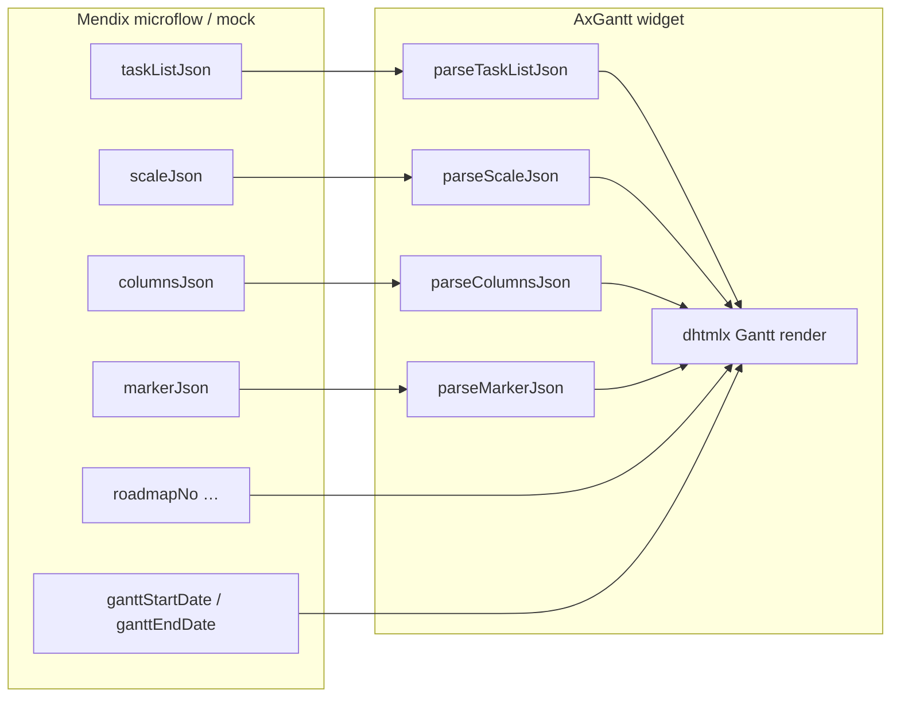

# 12. JSON Reference — Toàn bộ field & chức năng

Tài liệu giải thích **mọi mục** trong bundle JSON AxGantt: vai trò, widget property tương ứng, validation, và ví dụ từ mock.

**File mẫu đầy đủ:** [`mock/axgantt-roadmap.mock.full.json`](../mock/axgantt-roadmap.mock.full.json)  
**Contract gốc:** [`specs/001-dhl-gantt-chart/contracts/axgantt-json-schemas.md`](../specs/001-dhl-gantt-chart/contracts/axgantt-json-schemas.md)

---

## 1. Tổng quan kiến trúc

AxGantt **không** đọc một file JSON duy nhất trên runtime Mendix. Mendix truyền **nhiều string expression** riêng biệt vào widget. File `axgantt-roadmap.mock.full.json` gom tất cả để dễ đọc / export.



| Khối JSON / prop | Bắt buộc | Widget property | Nhiệm vụ chính |
|------------------|----------|-----------------|----------------|
| `taskListJson` | ✅ (production) | `taskListJson` | Cây WBS + bar timeline + links |
| `scaleJson` | ❌ (có default) | `scaleJson` | Header timeline: năm, tuần, … |
| `columnsJson` | ❌ (có default) | `columnsJson` | Cột grid bên trái |
| `markerJson` | ❌ | `markerJson` + `enableMarker=true` | Vạch dọc mốc thời gian |
| `ganttStartDate` / `ganttEndDate` | Khuyến nghị | `ganttStartDate`, `ganttEndDate` | Giới hạn vùng timeline hiển thị |
| Header PM | ❌ | `roadmapNo`, `roadmapRevision`, … | Dòng metadata phía trên chart |

---

## 2. Bundle mock — cấu trúc root

File [`mock/axgantt-roadmap.mock.full.json`](../mock/axgantt-roadmap.mock.full.json):

```json
{
  "ganttStartDate": "2025-01-01",
  "ganttEndDate": "2028-12-31",
  "roadmapNo": "Msoc251030-155",
  "roadmapRevision": "3",
  "roadmapRevisedBy": "mxadmin",
  "roadmapRevisedAt": "2026-06-07T08:00:00",
  "taskListJson": { "tasks": [...], "links": [...] },
  "scaleJson": { ... },
  "columnsJson": { ... },
  "markerJson": { ... }
}
```

### 2.1 `ganttStartDate` / `ganttEndDate`

| | |
|---|---|
| **Kiểu** | `YYYY-MM-DD` (mock) hoặc Mendix DateTime |
| **Widget prop** | `ganttStartDate`, `ganttEndDate` |
| **Nhiệm vụ** | Cắt (clip) timeline: chỉ hiển thị cột từ ngày bắt đầu đến ngày kết thúc |
| **Không nằm trong** | `scaleJson`, `taskListJson` |
| **Mock** | `2025-01-01` → `2028-12-31` (4 năm roadmap) |

Khi set cả hai, widget tắt `fit_tasks` tự thu hẹp theo task — giữ đủ band năm/tuần theo range đã chọn.

**Oracle / Mendix:** lưu trên entity `Roadmap` (`sim_roadmap.gantt_start`, `gantt_end`).

---

### 2.2 PM Roadmap Header (4 field)

Hiển thị bởi component `PmRoadmapHeader` — **không** parse từ JSON string, bind trực tiếp expression.

| Field mock | Widget prop | Nhiệm vụ | Ví dụ mock |
|------------|-------------|----------|------------|
| `roadmapNo` | `roadmapNo` | Số hiệu tài liệu roadmap | `Msoc251030-155` |
| `roadmapRevision` | `roadmapRevision` | Phiên bản / revision | `3` |
| `roadmapRevisedBy` | `roadmapRevisedBy` | User sửa lần cuối | `mxadmin` |
| `roadmapRevisedAt` | `roadmapRevisedAt` | Thời điểm sửa (ISO hoặc DateTime) | `2026-06-07T08:00:00` |

Field rỗng → segment tương ứng **ẩn** trên UI.

---

## 3. `taskListJson` — dữ liệu Gantt chính

**Root shape:**

```json
{
  "tasks": [ /* AxGanttTask[] — bắt buộc, không rỗng */ ],
  "links": [ /* AxGanttLink[] — tùy chọn */ ]
}
```

**Microflow:** `MF_BuildTaskListJson($Roadmap)`  
**Parser:** `src/adapters/parseTaskListJson.ts`

### 3.1 Nhiệm vụ tổng thể

- Định nghĩa **cây phân cấp** bên trái (grid) và **thanh/bar** bên phải (timeline).
- Là **nguồn duy nhất** cho task id, tên, ngày, parent, progress, màu bar.
- Khi JSON thay đổi → widget **parse lại toàn bộ** chart (refresh sau save/delete Mendix).

---

### 3.2 Object `tasks[]` — từng field

| Field | Kiểu | Bắt buộc | Default | Nhiệm vụ / hiển thị |
|-------|------|----------|---------|---------------------|
| **`id`** | string | ✅ | — | Khóa duy nhất toàn chart. Map Mendix `TaskKey`. Dùng trong action context (`taskId`), links, parent. |
| **`text`** | string | ✅ | `id` nếu rỗng | Tên hiển thị cột grid (cột `text`) và tooltip bar. |
| **`start`** | string ISO date | ✅ | — | Ngày bắt đầu bar (`YYYY-MM-DD`). Lỗi parse → skip task (E005). |
| **`end`** | string ISO date | ⚠️ | — | Ngày kết thúc bar. Nên có `end` hoặc `duration`. |
| **`duration`** | number | ⚠️ | — | Số ngày (thay cho `end`). Widget tính `end = start + duration`. |
| **`parent`** | string | ❌ | root | `id` của task cha. Tạo WBS tree. Phải tồn tại trong cùng `tasks[]`. |
| **`type`** | enum | ❌ | `"task"` | `"task"` \| `"project"` \| `"milestone"`. Ảnh hưởng bar style và rollup. |
| **`open`** | boolean | ❌ | `true` nếu `type=project` | Node `project` expand/collapse trên grid. |
| **`progress`** | number 0..1 | ❌ | — | % hoàn thành trên bar (0.35 = 35%). Chỉ ý nghĩa với `type=task`. |
| **`readonly`** | boolean | ❌ | false | Khóa drag/resize task đó (widget check trước drag). |
| **`color`** | string hex | ❌ | theme | Màu bar timeline, VD `#4F46E5`. |
| **`level`** | enum | ❌ | — | Gợi ý phân cấp PM: `portfolio` → `program` → `phase` → `product` → `task`. Dùng CSS row/bar (`axgantt-row--*`) và action context. |
| **custom fields** | any | ❌ | — | Field thêm (VD `owner`, `status`) — hiện nếu khai báo trong `columnsJson`. |

#### Giá trị `type`

| Giá trị | Vai trò trên chart |
|---------|-------------------|
| `project` | Hàng nhóm (portfolio/program/phase): thường **không** có bar riêng rõ, có icon expand. Cha của các task con. |
| `task` | Bar kéo dài theo `start`–`end`. Product/work package. |
| `milestone` | Điểm mốc một ngày (`start` = `end`). Kim cương / chấm trên timeline. |

#### Giá trị `level` (5 tầng PM roadmap)

```
portfolio  →  PF-1     Samsung DS PM Roadmap 2025–2028
  program  →  PRG-AL   2026 · Advanced Logic
    phase  →  PH-AL-1  Phase I · 2026
   product  →  PROD-ALPHA  Product Alpha
      task  →  TSK-FREEZE  Design freeze (milestone)
```

| Level | Ví dụ id mock | `type` thường dùng |
|-------|---------------|-------------------|
| `portfolio` | `PF-1` | `project` |
| `program` | `PRG-2025`, `PRG-AL` | `project` |
| `phase` | `PH-AL-1` | `project` |
| `product` | `PROD-ALPHA` | `task` |
| `task` | `TSK-FREEZE` | `milestone` hoặc `task` |

**Validation:** depth > 5 → warning E004, vẫn render.

#### Thứ tự mảng `tasks`

Khuyến nghị: **parent trước child** (parentKey ASC, StartDate ASC khi build từ Mendix). Parser không reorder — thứ tự sai có thể gây lỗi hiển thị tạm trên dhtmlx.

---

### 3.3 Object `links[]` — phụ thuộc giữa task

| Field | Kiểu | Bắt buộc | Nhiệm vụ |
|-------|------|----------|----------|
| **`id`** | string | ✅ | Id duy nhất của link |
| **`source`** | string | ✅ | `id` task nguồn |
| **`target`** | string | ✅ | `id` task đích |
| **`type`** | 0..3 | ✅ | Loại dependency (dhtmlx link type) |
| **`lag`** | number | ❌ | Độ trễ ngày giữa source và target |

#### Bảng `type` (dependency)

| `type` | Tên | Ý nghĩa |
|--------|-----|---------|
| **0** | Finish-to-Start (FS) | Target bắt đầu sau khi source kết thúc |
| **1** | Start-to-Start (SS) | Target bắt đầu khi source bắt đầu |
| **2** | Finish-to-Finish (FF) | Target kết thúc khi source kết thúc |
| **3** | Start-to-Finish (SF) | Target kết thúc sau khi source bắt đầu |

**Mock links (tất cả FS = 0):**

| id | source | target | Ý nghĩa nghiệp vụ |
|----|--------|--------|-------------------|
| LN-1 | TSK-FREEZE | PROD-BETA | Sau design freeze mới chạy Beta |
| LN-2 | TSK-RTL | TSK-TAPEOUT | RTL xong mới tape-out |
| LN-3 | TSK-2025-GO | PROD-ALPHA | Go-live 2025 → kickoff Alpha |
| LN-4 | TSK-GAMMA-GA | PROD-2027-NPU | Gamma GA → NPU Gen-2 |
| LN-5 | TSK-2027-GA | PROD-2028-FAB | Platform GA 2027 → Fab Line C |

---

### 3.4 Validation `taskListJson`

| Mã | Điều kiện | Hậu quả |
|----|-----------|---------|
| **E001** | JSON rỗng / không hợp lệ / `tasks` rỗng | Không render — empty state |
| **E002** | Trùng `id` | Không render |
| **E003** | `parent` không tồn tại | Không render |
| **E004** | Depth > 5 | Warning, vẫn render |
| **E005** | `start` không parse được | Skip task + warning |
| **W101** | Thiếu cả `end` và `duration` | Default bar 1 ngày |

---

## 4. `scaleJson` — cấu hình header timeline

**Microflow:** `MF_BuildScaleJson($Roadmap)`  
**Parser:** `src/adapters/parseScaleJson.ts`  
**Engine:** `src/engine/scaleBuilder.ts`

Rỗng hoặc `{}` → default: **năm + tuần W##** (`anchorYear: 2026`).

### 4.1 Root fields

| Field | Kiểu | Default | Nhiệm vụ |
|-------|------|---------|----------|
| **`anchorYear`** | number | `2026` | Năm gốc tính ISO week. 2026 có **53 tuần**. |
| **`weekLabelFormat`** | `"W##"` \| `"T##"` | `"W##"` | Format nhãn hàng tuần. `W##` → hiển thị **Tuần 01**, **Tuần 02**, … |
| **`scales`** | array | year + week | Danh sách **hàng header** timeline (trên → dưới). |

**Mock:**

```json
{
  "anchorYear": 2026,
  "weekLabelFormat": "W##",
  "scales": [
    { "unit": "year", "step": 1, "format": "year" },
    { "unit": "week", "step": 1, "format": "W##" }
  ]
}
```

**Kết quả UI:**

```
┌──────── 2025 ──────── 2026 ──────── 2027 ──────── 2028 ────┐  ← scales[0] unit=year
├── Tuần01 │ Tuần02 │ … │ Tuần53 │ Tuần01 │ … ────────────────┤  ← scales[1] unit=week
```

---

### 4.2 Object `scales[]`

| Field | Kiểu | Default | Nhiệm vụ |
|-------|------|---------|----------|
| **`unit`** | string | — | Đơn vị cột: `"year"` \| `"month"` \| `"week"` \| `"day"` |
| **`step`** | number | `1` | Bước nhảy (1 = từng năm/tuần/tháng) |
| **`format`** | string | — | Preset format label (xem bảng dưới) |

| `unit` | `format` hợp lệ | Label ví dụ |
|--------|-----------------|-------------|
| `year` | `year`, `YYYY` | `2026`, `2027` |
| `week` | `W##`, `T##` | Tuần 01 … / T01 … |
| `month` | `month`, `MMM YYYY`, … | Tháng |
| `day` | `day`, `dd MMM`, … | 25 May |

**Lưu ý:** Khi có `scaleJson`, widget **không** dùng zoom extension mặc định (hour/day) — tránh ghi đè executive timeline.

**Oracle:** `sim_scale` + `sim_scale_row` — xem [10-oracle-scale-domain.md](./10-oracle-scale-domain.md).

---

## 5. `columnsJson` — cột grid bên trái

**Parser:** `src/adapters/parseColumnsJson.ts`  
Rỗng → default: một cột `Project` (tree, width 300).

### 5.1 Root

| Field | Nhiệm vụ |
|-------|----------|
| **`columns`** | Mảng định nghĩa cột grid **bên trái** timeline (không phải header năm/tuần). |

### 5.2 Object `columns[]`

| Field | Kiểu | Default | Nhiệm vụ |
|-------|------|---------|----------|
| **`name`** | string | — | Tên field trên task object. `"text"` = cột tên task + tree. |
| **`label`** | string | — | Header text cột trên grid |
| **`tree`** | boolean | false | `true` chỉ nên có **một** cột — bật WBS tree + indent |
| **`width`** | number | `*` auto | Độ rộng pixel |
| **`resize`** | boolean | true | Cho phép kéo rộng cột (nếu widget `gridResize=true`) |
| **`align`** | string | left | `"left"` \| `"center"` \| `"right"` |
| **`template`** | string | — | Tên field khác trên task để lấy giá trị cell (nếu khác `name`) |

**Mock (tối giản):**

```json
{
  "columns": [
    { "name": "text", "label": "Project", "tree": true, "width": 300, "resize": true }
  ]
}
```

**Mở rộng (cần field trên task):**

```json
{
  "columns": [
    { "name": "text", "label": "Project", "tree": true, "width": 280 },
    { "name": "owner", "label": "Owner", "width": 120, "align": "left" },
    { "name": "status", "label": "Status", "width": 100, "align": "center" }
  ]
}
```

→ Task phải có `"owner": "..."`, `"status": "..."` trong `taskListJson`.

---

## 6. `markerJson` — vạch mốc trên timeline

**Parser:** `src/adapters/parseMarkerJson.ts`  
**Engine:** `src/engine/plugins/markers.ts`  
**Điều kiện:** widget `enableMarker = true`

### 6.1 Khác gì milestone trong `tasks`?

| | Milestone **task** | **Marker** |
|---|-------------------|------------|
| Nằm trong WBS grid | ✅ | ❌ |
| Bar / kim trên timeline | ✅ (task) | Chỉ **vạch dọc** |
| Dùng cho deadline tham chiếu | Có thể | **Chuyên cho mốc** (today, rev, tape-out) |
| Cần `enableMarker` | ❌ | ✅ |

### 6.2 Root

| Field | Nhiệm vụ |
|-------|----------|
| **`markers`** | Mảng vạch dọc. Rỗng → không marker (dù `enableMarker=true`). |

### 6.3 Object `markers[]`

| Field | Kiểu | Bắt buộc | Nhiệm vụ |
|-------|------|----------|----------|
| **`start_date`** | `YYYY-MM-DD` | ✅ | Vị trí ngày trên timeline |
| **`css`** | string | ❌ | Class CSS vạch. Default `axgantt-marker` (đỏ) |
| **`text`** | string | ❌ | Nhãn trên timeline |
| **`title`** | string | ❌ | Tooltip hover (nếu bỏ trống → dùng `text`) |

**Mock — 6 marker:**

| text | start_date | title (tooltip) |
|------|------------|-----------------|
| Arch review | 2025-04-14 | Architecture review complete |
| Design freeze | 2026-02-23 | Product Alpha — W08 |
| Tape-out | 2026-09-21 | DRAM Gen-X — W38 |
| Silicon | 2027-05-18 | NPU Gen-2 silicon bring-up |
| Groundbreak | 2028-04-17 | Fab Line C groundbreaking |
| Year close | 2026-12-28 | Portfolio year-end W53 |

**Microflow:** `MF_BuildMarkerJson($Roadmap)` — aggregate milestone quan trọng hoặc ngày nghiệp vụ.

---

## 7. Ma trận: field JSON → widget → Mendix

| JSON / data | Widget property | Mendix entity (gợi ý) | Refresh khi nào |
|-------------|-----------------|----------------------|-----------------|
| `tasks[]` | `taskListJson` | `RoadmapTask` | Sau save/delete/move MF |
| `links[]` | `taskListJson` | `RoadmapTaskLink` | Cùng taskListJson |
| `scaleJson` | `scaleJson` | `sim_scale`, `sim_scale_row` | Đổi cấu hình timeline |
| `columnsJson` | `columnsJson` | Config / constant MF | Đổi layout grid |
| `markerJson` | `markerJson` | `RoadmapMarker` | Đổi mốc |
| Timeline clip | `ganttStartDate`, `ganttEndDate` | `Roadmap` | Đổi range năm |
| Header | `roadmapNo`, … | `Roadmap` | Đổi metadata |

---

## 8. Thống kê mock hiện tại

| Metric | Giá trị |
|--------|---------|
| Timeline | 2025-01-01 → 2028-12-31 |
| Tasks | 35 |
| Links | 5 (FS) |
| Programs | 5 (2025, 2026×2, 2027, 2028) |
| Markers | 6 |
| Scale rows | 2 (year + week) |
| Columns | 1 (Project tree) |

---

## 9. Wiring Mendix (tóm tắt)

```
taskListJson   = MF_BuildTaskListJson($Roadmap)
scaleJson      = MF_BuildScaleJson($Roadmap)
columnsJson    = MF_BuildColumnsJson()
markerJson     = MF_BuildMarkerJson($Roadmap)
ganttStartDate = $Roadmap/GanttStartDate
ganttEndDate   = $Roadmap/GanttEndDate
enableMarker   = true

roadmapNo        = $Roadmap/DocumentNo
roadmapRevision  = $Roadmap/Revision
roadmapRevisedBy = $Roadmap/RevisedBy
roadmapRevisedAt = $Roadmap/RevisedAt
```

**Refresh chart sau thay đổi:** commit DB → expression `taskListJson` (và marker nếu cần) **evaluate lại** → widget tự parse. Không có API refresh nội bộ từ Mendix dialog nếu JSON string không đổi.

---

## 10. Liên kết tài liệu liên quan

| Chủ đề | Doc |
|--------|-----|
| Timeline / scale chi tiết | [06-filtering-and-timeline.md](./06-filtering-and-timeline.md) |
| Mock file & dev | [04-mock-data.md](./04-mock-data.md) |
| Oracle scale | [10-oracle-scale-domain.md](./10-oracle-scale-domain.md) |
| Microflow build JSON | [05-mendix-integration.md](./05-mendix-integration.md) |
| Action / refresh delete | [07-events-and-actions.md](./07-events-and-actions.md) |
