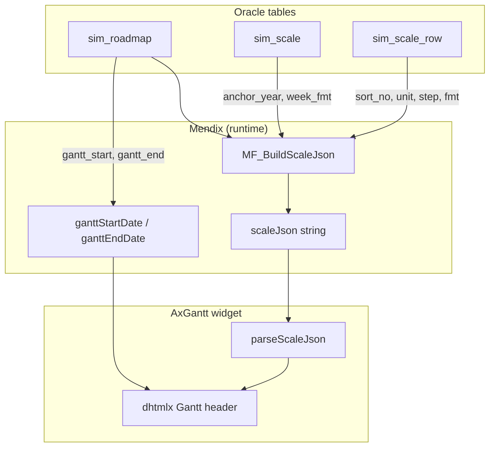

# 13. Oracle — Hướng dẫn DBA (quan hệ bảng & vận hành)

Tài liệu này dành cho **DBA hoặc người quản trị Oracle mới** tham gia dự án **AxGantt / DHL Gantt Chart**. Mục tiêu: hiểu **bảng nào liên kết với bảng nào**, dữ liệu đi đâu trên widget Mendix, và cách cài đặt / kiểm tra trên Oracle 19c + DBeaver.

**DDL tham chiếu:** thư mục [`docs/sql/`](sql/) — prefix **`sim_*`** (module Mendix **`Simulator`**)  
**Chi tiết Mendix entity:** [`10-oracle-scale-domain.md`](10-oracle-scale-domain.md)  
**Toàn bộ field JSON widget:** [`12-json-reference.md`](12-json-reference.md)

### Quy ước đặt tên (Simulator)

| Lớp | Ví dụ | Ghi chú |
|-----|-------|---------|
| Mendix module | **`Simulator`** | Domain, MF, NF, pages |
| Mendix entity | `Roadmap`, `RoadmapScaleConfig`, … | Studio Pro |
| Bảng Oracle (deploy Mendix) | `simulator$roadmap`, `simulator$roadmapscaleconfig` | Mendix tự sinh |
| **DDL lab** (`docs/sql/`) | `sim_roadmap`, `sim_scale`, `sim_scale_row` | DBA review / PoC; map 1:1 logic với entity |
| View lab | `v_sim_scale_json` | Aggregate scaleJson |

Script cài đặt **drop cả `pm_*` cũ** (tên trước khi đổi sang Simulator) rồi tạo `sim_*`.

---

## 1. Bối cảnh — Widget cần gì từ database?

Widget AxGantt **không** đọc trực tiếp bảng Oracle. Mendix microflow aggregate dữ liệu thành **chuỗi JSON** rồi truyền vào widget qua các property:

| Nguồn dữ liệu (logic) | Widget property | Có bảng Oracle tham chiếu? |
|------------------------|-----------------|---------------------------|
| Cây WBS + bar timeline | `taskListJson` | ❌ Chưa có DDL Oracle (chỉ mock TypeScript) |
| Header timeline (năm / tuần) | `scaleJson` | ✅ **`sim_scale` + `sim_scale_row`** |
| Cột grid trái | `columnsJson` | ❌ Chưa có DDL Oracle |
| Vạch dọc mốc thời gian | `markerJson` | ❌ Chưa có DDL Oracle |
| Giới hạn timeline | `ganttStartDate`, `ganttEndDate` | ✅ **`sim_roadmap.gantt_start` / `gantt_end`** |
| Metadata header PM | `roadmapNo`, `roadmapRevision`, … | ✅ **`sim_roadmap`** |

**Phạm vi Oracle hiện tại:** lưu **roadmap header**, **timeline bounds**, và **cấu hình scaleJson** (preset template tùy chọn). Phần task/WBS sẽ do Mendix domain riêng hoặc DDL bổ sung sau.

---

## 2. Sơ đồ quan hệ (Oracle)

```mermaid
erDiagram
    sim_roadmap ||--o| sim_scale : "1 roadmap - 0..1 scale config"
    sim_scale ||--|{ sim_scale_row : "1 scale - N rows ordered"
    sim_scale_tpl ||--|{ sim_scale_tpl_row : "1 template - N preset rows"
    sim_scale }o--o| sim_scale_tpl : "optional copy source"

    sim_roadmap {
        NUMBER id PK
        VARCHAR2 doc_no
        VARCHAR2 revision
        DATE gantt_start
        DATE gantt_end
        NUMBER is_active
    }

    sim_scale {
        NUMBER id PK
        NUMBER roadmap_id FK UK
        NUMBER anchor_year
        VARCHAR2 week_fmt
        NUMBER tpl_id FK
    }

    sim_scale_row {
        NUMBER id PK
        NUMBER scale_id FK
        NUMBER sort_no UK
        VARCHAR2 unit
        NUMBER step_val
        VARCHAR2 fmt_key
    }

    sim_scale_tpl {
        NUMBER id PK
        VARCHAR2 code UK
        NUMBER anchor_year
        VARCHAR2 week_fmt
    }

    sim_scale_tpl_row {
        NUMBER id PK
        NUMBER tpl_id FK
        NUMBER sort_no UK
        VARCHAR2 unit
        VARCHAR2 fmt_key
    }
```

### 2.1 Tóm tắt quan hệ bằng lời

| Quan hệ | Cardinality | FK | ON DELETE | Ý nghĩa |
|---------|-------------|-----|-----------|---------|
| `sim_roadmap` → `sim_scale` | **1 : 0..1** | `sim_scale.roadmap_id` | **CASCADE** | Mỗi roadmap tối đa **một** cấu hình scaleJson. Xóa roadmap → xóa luôn scale + rows. |
| `sim_scale` → `sim_scale_row` | **1 : N** | `sim_scale_row.scale_id` | **CASCADE** | Các hàng timeline (năm, tuần, …). Thứ tự bằng `sort_no`. |
| `sim_scale_tpl` → `sim_scale_tpl_row` | **1 : N** | `sim_scale_tpl_row.tpl_id` | **CASCADE** | Preset admin; copy sang roadmap khi apply template. |
| `sim_scale` → `sim_scale_tpl` | **N : 0..1** | `sim_scale.tpl_id` | *(không cascade)* | Ghi nhận roadmap scale được copy từ template nào (nullable). |

**Không có FK trực tiếp** giữa `sim_roadmap` và `sim_scale_tpl`. Liên kết gián tiếp qua `sim_scale.tpl_id`.

### 2.2 Thứ tự phụ thuộc khi INSERT / DELETE

**INSERT (cha trước, con sau):**

```
sim_scale_tpl → sim_scale_tpl_row
sim_roadmap   → sim_scale → sim_scale_row
```

**DELETE thủ công (con trước nếu không dùng CASCADE):**

```
sim_scale_row → sim_scale → sim_roadmap
sim_scale_tpl_row → sim_scale_tpl
```

Script seed dùng `DELETE` theo thứ tự con → cha trước khi insert lại.

---

## 3. Danh sách object Oracle

| Object | Loại | Mô tả ngắn |
|--------|------|------------|
| `sim_roadmap` | Table | Header roadmap PM + ngày bắt đầu/kết thúc Gantt |
| `sim_scale` | Table | Root của `scaleJson` (`anchorYear`, `weekLabelFormat`) |
| `sim_scale_row` | Table | Mảng `scaleJson.scales[]` |
| `sim_scale_tpl` | Table | Template preset (admin) |
| `sim_scale_tpl_row` | Table | Dòng preset trong template |
| `v_sim_scale_json` | View | Gom JSON scale theo roadmap (Oracle 19c `JSON_OBJECT`) |
| `sim_roadmap_seq` | Sequence | Sinh ID roadmap mới |
| `sim_scale_seq` | Sequence | Sinh ID scale |
| `sim_scale_row_seq` | Sequence | Sinh ID scale row |
| `sim_scale_tpl_seq` | Sequence | Sinh ID template |
| `sim_scale_tpl_row_seq` | Sequence | Sinh ID template row |

Prefix **`sim_`** = DDL lab module **`Simulator`**. Mendix deploy sinh bảng `simulator$*` (xem mục 8).

---

## 4. Chi tiết từng bảng

### 4.1 `sim_roadmap` — Roadmap & timeline bounds

**Vai trò:** Một bản ghi = một roadmap PM (số tài liệu, revision, khoảng thời gian hiển thị trên Gantt).

| Cột | Kiểu | NULL | Mặc định | Ghi chú |
|-----|------|------|----------|---------|
| `id` | NUMBER(20) | NOT NULL | — | PK; Mendix-style long (vd. `170607000000010`) |
| `doc_no` | VARCHAR2(64) | NOT NULL | — | Số roadmap → widget `roadmapNo` |
| `revision` | VARCHAR2(16) | NULL | — | → `roadmapRevision` |
| `revised_by` | VARCHAR2(128) | NULL | — | → `roadmapRevisedBy` |
| `revised_at` | TIMESTAMP(6) | NULL | — | → `roadmapRevisedAt` |
| `gantt_start` | DATE | NOT NULL | — | → widget `ganttStartDate` |
| `gantt_end` | DATE | NOT NULL | — | → widget `ganttEndDate` |
| `is_active` | NUMBER(1) | NOT NULL | 1 | 0/1 — lọc roadmap đang dùng |
| `created_at` | TIMESTAMP(6) | NOT NULL | SYSTIMESTAMP | Audit |
| `updated_at` | TIMESTAMP(6) | NOT NULL | SYSTIMESTAMP | Audit |

**Ràng buộc:**

| Tên | Loại | Nội dung |
|-----|------|----------|
| `pk_sim_roadmap` | PRIMARY KEY | `(id)` |
| `uk_sim_roadmap_doc` | UNIQUE | `(doc_no, revision)` — không trùng cặp số + revision |
| `ck_sim_roadmap_dates` | CHECK | `gantt_end >= gantt_start` |
| `ck_sim_roadmap_active` | CHECK | `is_active IN (0, 1)` |

**Index:** `ix_sim_roadmap_active (is_active, gantt_start)` — truy vấn roadmap active theo thời gian.

**Con:** `sim_scale` (0 hoặc 1 bản ghi / roadmap).

---

### 4.2 `sim_scale` — Root `scaleJson`

**Vai trò:** Lưu hai field gốc của JSON timeline header + liên kết roadmap.

| Cột | Kiểu | NULL | Mặc định | Map JSON / widget |
|-----|------|------|----------|-------------------|
| `id` | NUMBER(20) | NOT NULL | — | PK |
| `roadmap_id` | NUMBER(20) | NOT NULL | — | FK → `sim_roadmap.id` |
| `anchor_year` | NUMBER(4) | NOT NULL | — | `scaleJson.anchorYear` (mock: **2026**) |
| `week_fmt` | VARCHAR2(8) | NOT NULL | `W##` | `scaleJson.weekLabelFormat` (`W##` hoặc `T##`) |
| `display_name` | VARCHAR2(128) | NULL | — | Tên mô tả nội bộ |
| `note` | VARCHAR2(512) | NULL | — | Ghi chú |
| `tpl_id` | NUMBER(20) | NULL | — | FK → template đã apply (optional) |
| `created_at`, `updated_at` | TIMESTAMP(6) | NOT NULL | SYSTIMESTAMP | Audit |

**Ràng buộc:**

| Tên | Loại | Nội dung |
|-----|------|----------|
| `pk_sim_scale` | PRIMARY KEY | `(id)` |
| `uk_sim_scale_roadmap` | UNIQUE | `(roadmap_id)` — **một roadmap chỉ một scale** |
| `fk_sim_scale_roadmap` | FOREIGN KEY | `roadmap_id` → `sim_roadmap(id)` **ON DELETE CASCADE** |
| `fk_sim_scale_tpl` | FOREIGN KEY | `tpl_id` → `sim_scale_tpl(id)` |
| `ck_sim_scale_year` | CHECK | `anchor_year BETWEEN 1970 AND 2100` |
| `ck_sim_scale_week_fmt` | CHECK | `week_fmt` ∈ {`W##`, `T##`} |

**Con:** nhiều `sim_scale_row`.

**Lưu ý nghiệp vụ:** `anchor_year = 2026` dùng cho lịch ISO 53 tuần (năm có 53 cột tuần). Widget map `W##` → nhãn **Tuần 01, Tuần 02, …** trên header.

---

### 4.3 `sim_scale_row` — Mảng `scaleJson.scales[]`

**Vai trò:** Mỗi dòng = một hàng trên header timeline (năm ở trên, tuần ở dưới trong preset executive).

| Cột | Kiểu | NULL | Map JSON |
|-----|------|------|----------|
| `id` | NUMBER(20) | NOT NULL | PK |
| `scale_id` | NUMBER(20) | NOT NULL | FK → `sim_scale.id` |
| `sort_no` | NUMBER(5) | NOT NULL | **Thứ tự mảng** — 0 = hàng trên |
| `unit` | VARCHAR2(16) | NOT NULL | `scales[n].unit` (`year`, `week`, …) |
| `step_val` | NUMBER(5) | NOT NULL, default 1 | `scales[n].step` |
| `fmt_key` | VARCHAR2(32) | NOT NULL | `scales[n].format` |
| `created_at`, `updated_at` | TIMESTAMP(6) | NOT NULL | Audit |

**Ràng buộc quan trọng:**

| Tên | Ý nghĩa |
|-----|---------|
| `uk_sim_scale_row_order` | UNIQUE `(scale_id, sort_no)` — không trùng thứ tự trong cùng scale; **đồng thời tạo index** cho cặp cột này |
| `fk_sim_scale_row_scale` | ON DELETE CASCADE |
| `ck_sim_scale_row_unit` | `unit` ∈ {`year`, `month`, `week`, `day`} |
| `ck_sim_scale_row_fmt` | `fmt_key` phải khớp `unit` (vd. week → `W##` hoặc `T##`) |

**Preset executive (mock seed):**

| sort_no | unit | step_val | fmt_key | Hiển thị |
|---------|------|----------|---------|----------|
| 0 | year | 1 | year | Hàng năm (2025, 2026, …) |
| 1 | week | 1 | W## | Hàng tuần (Tuần 01 …) |

**Không tạo thêm index** `ix_sim_scale_row_scale` — đã bị ORA-01408 vì trùng UNIQUE `(scale_id, sort_no)`.

---

### 4.4 `sim_scale_tpl` — Template preset (admin)

**Vai trò:** Kho cấu hình scale mẫu; admin copy sang roadmap mới (tương đương Mendix `ScaleTemplate`).

| Cột | Kiểu | Ghi chú |
|-----|------|---------|
| `id` | NUMBER(20) PK | |
| `code` | VARCHAR2(32) UNIQUE | Mã template, vd. `EXEC_YW` |
| `display_name` | VARCHAR2(128) | Tên hiển thị (tránh dùng cột `name` — reserved word) |
| `anchor_year` | NUMBER(4) | Năm neo mặc định |
| `week_fmt` | VARCHAR2(8) | `W##` / `T##` |
| `is_default` | NUMBER(1) | 1 = template mặc định |
| `is_active` | NUMBER(1) | 1 = đang dùng |
| `created_at`, `updated_at` | TIMESTAMP(6) | Audit |

**Con:** `sim_scale_tpl_row` (cấu trúc giống `sim_scale_row` nhưng gắn `tpl_id`).

---

### 4.5 `sim_scale_tpl_row` — Dòng trong template

Cùng pattern với `sim_scale_row`: `sort_no`, `unit`, `step_val`, `fmt_key`.  
UNIQUE `(tpl_id, sort_no)`. FK `tpl_id` → `sim_scale_tpl` ON DELETE CASCADE.

---

### 4.6 View `v_sim_scale_json`

**Vai trò:** Trả về một cột CLOB JSON cho mỗi roadmap có cấu hình scale — tiện cho DBA kiểm tra hoặc báo cáo, **không bắt buộc** cho Mendix (Mendix thường build JSON bằng microflow).

```sql
SELECT roadmap_id, doc_no, scale_json
FROM v_sim_scale_json
WHERE roadmap_id = 170607000000010
```

**Kết quả mẫu (mock seed):**

```json
{
  "anchorYear": 2026,
  "weekLabelFormat": "W##",
  "scales": [
    { "unit": "year", "step": 1, "format": "year" },
    { "unit": "week", "step": 1, "format": "W##" }
  ]
}
```

View JOIN: `sim_roadmap` INNER JOIN `sim_scale` INNER JOIN subquery aggregate `sim_scale_row` ORDER BY `sort_no`.

---

## 5. Luồng dữ liệu: bảng → JSON → widget



| Trường widget | Nguồn Oracle |
|---------------|--------------|
| `ganttStartDate` | `sim_roadmap.gantt_start` |
| `ganttEndDate` | `sim_roadmap.gantt_end` |
| `roadmapNo` | `sim_roadmap.doc_no` |
| `roadmapRevision` | `sim_roadmap.revision` |
| `scaleJson.anchorYear` | `sim_scale.anchor_year` |
| `scaleJson.weekLabelFormat` | `sim_scale.week_fmt` |
| `scaleJson.scales[]` | `sim_scale_row` ORDER BY `sort_no` |

---

## 6. Sequence & chiến lược ID

| Sequence | Bảng dùng | Ghi chú |
|----------|-----------|---------|
| `sim_roadmap_seq` | `sim_roadmap.id` | |
| `sim_scale_seq` | `sim_scale.id` | |
| `sim_scale_row_seq` | `sim_scale_row.id` | |
| `sim_scale_tpl_seq` | `sim_scale_tpl.id` | |
| `sim_scale_tpl_row_seq` | `sim_scale_tpl_row.id` | |

**Mock seed** dùng ID cố định kiểu Mendix (`170607000000001` … `170607000000013`), sau đó reset sequence về `170607000000100` để ID mới không đè mock.

**Mendix production:** ID do Mendix sinh khi commit object; sequence Oracle chỉ cần nếu insert trực tiếp bằng SQL.

---

## 7. Cài đặt & kiểm tra (DBeaver + Oracle 19c)

### 7.1 Thứ tự file SQL

| Bước | File | Ghi chú |
|------|------|---------|
| 1 | [`oracle-axgantt-scale.sql`](sql/oracle-axgantt-scale.sql) | **Bắt buộc** — idempotent (drop + create), **một block PL/SQL**, Alt+X |
| 2 | [`oracle-axgantt-scale-seed.sql`](sql/oracle-axgantt-scale-seed.sql) | Mock data — **một block PL/SQL**, Alt+X |
| 3 | [`oracle-axgantt-scale-view.sql`](sql/oracle-axgantt-scale-view.sql) | View JSON — optional |
| 4 | [`oracle-axgantt-scale-seed-verify.sql`](sql/oracle-axgantt-scale-seed-verify.sql) | **Một SELECT** — kiểm tra JOIN |
| 5 | [`oracle-axgantt-scale-seed-verify-json.sql`](sql/oracle-axgantt-scale-seed-verify-json.sql) | **Một SELECT** — kiểm tra view |

[`oracle-axgantt-scale-drop.sql`](sql/oracle-axgantt-scale-drop.sql) — chỉ khi cần xóa mà không tạo lại (bước 1 đã gồm drop).

**Quan trọng:** Dùng **Execute SQL Script (Alt+X)** cho block PL/SQL. **Không** Ctrl+Enter từng dòng trong `DECLARE … END`.

### 7.2 Dữ liệu mock sau seed

| Bảng | ID chính | Nội dung |
|------|----------|----------|
| `sim_scale_tpl` | `170607000000001` | Template `EXEC_YW`, anchor 2026 |
| `sim_scale_tpl_row` | `…002`, `…003` | year + week |
| `sim_roadmap` | `170607000000010` | `Msoc251030-155` rev 3, 2025-01-01 → 2028-12-31 |
| `sim_scale` | `170607000000011` | Gắn roadmap `…010`, tpl `…001` |
| `sim_scale_row` | `…012`, `…013` | year row + week row |

### 7.3 Query hữu ích cho DBA

**Xem cấu hình scale đầy đủ (không cần view):**

```sql
SELECT
    r.id         AS roadmap_id,
    r.doc_no,
    r.gantt_start,
    r.gantt_end,
    s.anchor_year,
    s.week_fmt,
    sr.sort_no,
    sr.unit,
    sr.step_val,
    sr.fmt_key
FROM sim_roadmap r
INNER JOIN sim_scale s ON s.roadmap_id = r.id
INNER JOIN sim_scale_row sr ON sr.scale_id = s.id
WHERE r.doc_no = 'Msoc251030-155'
ORDER BY sr.sort_no
```

**Đếm bản ghi theo bảng:**

```sql
SELECT 'sim_roadmap' AS tbl, COUNT(*) AS cnt FROM sim_roadmap
UNION ALL SELECT 'sim_scale', COUNT(*) FROM sim_scale
UNION ALL SELECT 'sim_scale_row', COUNT(*) FROM sim_scale_row
UNION ALL SELECT 'sim_scale_tpl', COUNT(*) FROM sim_scale_tpl
UNION ALL SELECT 'sim_scale_tpl_row', COUNT(*) FROM sim_scale_tpl_row
```

**Roadmap thiếu scale (sẽ fallback default trên widget):**

```sql
SELECT r.id, r.doc_no
FROM sim_roadmap r
LEFT JOIN sim_scale s ON s.roadmap_id = r.id
WHERE s.id IS NULL
  AND r.is_active = 1
```

---

## 8. Oracle tham chiếu vs Mendix deploy

File SQL trong repo dùng tên **ngắn** để review. Khi deploy Mendix module **`Simulator`**, Oracle sẽ có bảng dạng:

| Entity Mendix | Bảng Mendix (ví dụ) | DDL tham chiếu |
|---------------|---------------------|----------------|
| `Roadmap` | `simulator$roadmap` | `sim_roadmap` |
| `RoadmapScaleConfig` | `simulator$roadmapscaleconfig` | `sim_scale` |
| `RoadmapScaleUnit` | `simulator$roadmapscaleunit` | `sim_scale_row` |
| `ScaleTemplate` | `simulator$scaletemplate` | `sim_scale_tpl` |
| `ScaleTemplateUnit` | `simulator$scaletemplateunit` | `sim_scale_tpl_row` |

**Quan hệ logic giữ nguyên**; chỉ khác tên bảng/cột association do Mendix sinh. DBA production làm việc trên bảng `$`; file `docs/sql/` dùng cho lab / PoC / review schema.

---

## 9. Ràng buộc nghiệp vụ `fmt_key` theo `unit`

| `unit` | `fmt_key` hợp lệ (CHECK constraint) |
|--------|-------------------------------------|
| year | `year`, `YYYY` |
| week | `W##`, `T##` |
| month | `month`, `MMM YYYY`, `MM/YYYY` |
| day | `day`, `dd MMM`, `DD/MM` |

Giá trị `W##` trong DDL/seed được lưu bằng `'W' || CHR(35) || CHR(35)` — **tránh ký tự `#`** trong file SQL (DBeaver parse sai).

---

## 10. Lỗi thường gặp khi chạy script

| Mã ORA | Nguyên nhân | Cách xử lý |
|--------|-------------|------------|
| **00933** | DBeaver + `;` trên DDL/SELECT rời, hoặc nhiều câu trong một lần execute | DDL/seed: block PL/SQL + Alt+X; verify: **một SELECT/file**, không `;` cuối |
| **00955** | Object đã tồn tại | Chạy lại `oracle-axgantt-scale.sql` (đã drop trước create) |
| **01408** | Index trùng cột đã có UNIQUE | Không thêm index `(scale_id, sort_no)` — UNIQUE đủ |
| **06550 / PLS-00103** | `SELECT` sau `END;` bị gộp vào block PL/SQL | Tách verify ra file riêng |
| **00942** | View chưa tạo | Chạy `oracle-axgantt-scale-view.sql` trước verify JSON |

---

## 11. Phạm vi chưa có trên Oracle

Các phần sau **chưa** có bảng Oracle trong repo (chỉ mock JSON / Mendix domain):

- **`taskListJson`** — cây 5 cấp WBS, task bar, links
- **`columnsJson`** — cấu hình cột grid
- **`markerJson`** — vạch dọc timeline

Khi mở rộng, nên tách module: `sim_task`, `sim_task_link`, … và giữ pattern FK cascade tương tự `sim_roadmap` → `sim_scale` → `sim_scale_row`.

---

## 12. Tài liệu liên quan

| Tài liệu | Nội dung |
|----------|----------|
| [`10-oracle-scale-domain.md`](10-oracle-scale-domain.md) | Mendix entity, enum, microflow `MF_BuildScaleJson` |
| [`12-json-reference.md`](12-json-reference.md) | Giải thích mọi field JSON widget |
| [`04-mock-data.md`](04-mock-data.md) | Mock executive portfolio 2025–2028 |
| [`sql/oracle-axgantt-scale-19c-install.sql`](sql/oracle-axgantt-scale-19c-install.sql) | Tóm tắt thứ tự cài đặt |
| [`specs/001-dhl-gantt-chart/contracts/axgantt-json-schemas.md`](../specs/001-dhl-gantt-chart/contracts/axgantt-json-schemas.md) | Contract JSON gốc |

---

## 13. Checklist DBA mới (5 phút)

1. Đọc mục 2 (sơ đồ quan hệ) và mục 4 (chi tiết bảng).
2. Chạy bước 1–2 SQL trên schema lab (Alt+X).
3. Chạy verify JOIN — kỳ vọng **2 dòng** scale_row cho roadmap `Msoc251030-155`.
4. (Optional) Tạo view + verify JSON.
5. Hiểu: production Mendix **không bắt buộc** dùng view — microflow build `scaleJson` từ entity.
