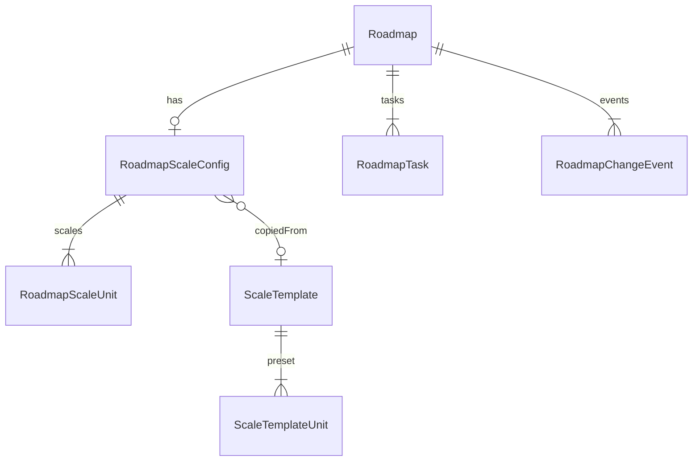
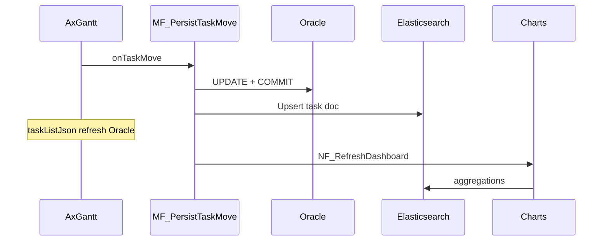

# 14. Mendix — Ghép nhanh (domain, flow, Elasticsearch)

Playbook **từng bước** để lên công ty ghép AxGantt + Oracle + dashboard ES trong **1–2 ngày**. Đọc song song mock [`mock/axgantt-roadmap.mock.full.json`](../mock/axgantt-roadmap.mock.full.json) để biết JSON mục tiêu.

**Chi tiết sâu:** [05-mendix-integration](./05-mendix-integration.md) · [10-oracle-scale-domain](./10-oracle-scale-domain.md) · [11-microflow-nanoflow-elasticsearch](./11-microflow-nanoflow-elasticsearch.md) · [12-json-reference](./12-json-reference.md) · [13-oracle-huong-dan-dba](./13-oracle-huong-dan-dba.md)

> **Module Mendix tại công ty:** tạo domain, microflow, nanoflow, page trong module **`Simulator`** (không tạo module `PMRoadmap` mới). Tên entity/logic trong doc giữ nguyên; chỉ đổi **namespace** sang `Simulator`.

---

## 0. Chuẩn bị (30 phút)

| Việc | Lệnh / ghi chú |
|------|----------------|
| Build widget | `pnpm install && pnpm run build` → `dist/1.0.0/mendix.*.AxGantt.mpk` |
| Import vào Mendix | App Store / Import widget package vào app công ty |
| **Nơi làm việc** | Module **`Simulator`** — domain, enum, MF, NF, pages |
| Oracle scale (lab) | Chạy `docs/sql/oracle-axgantt-scale.sql` + `seed.sql` (xem doc 13) |
| ES index (lab) | Apply `docs/sql/elasticsearch-roadmap-indices.json` lên cluster dev |

### 0.1 Quy ước tên trong module `Simulator`

| Trong tài liệu | Trong Studio Pro (Simulator) | Ví dụ microflow |
|----------------|------------------------------|-----------------|
| Entity `Roadmap` | `Simulator.Roadmap` | `Simulator.MF_BuildTaskListJson` |
| Entity `RoadmapTask` | `Simulator.RoadmapTask` | `Simulator.NF_ShowTaskDetail` |
| Page executive | `Simulator.Page_RoadmapExecutive` | — |

**Bảng Oracle sau deploy Mendix** (tên thật, lowercase):

| Entity | Bảng Oracle (ví dụ) | DDL lab tham chiếu |
|--------|----------------------|-------------------|
| `Roadmap` | `simulator$roadmap` | `sim_roadmap` |
| `RoadmapScaleConfig` | `simulator$roadmapscaleconfig` | `sim_scale` |
| `RoadmapScaleUnit` | `simulator$roadmapscaleunit` | `sim_scale_row` |
| `RoadmapTask` | `simulator$roadmaptask` | *(chưa có DDL lab)* |
| `ScaleTemplate` | `simulator$scaletemplate` | `sim_scale_tpl` |

Prefix **`sim_*`** trong `docs/sql/` = DDL lab module **`Simulator`** (map logic với `simulator$*`). Production: Mendix deploy tự tạo bảng `$`.

**Nếu `Simulator` đã có entity trùng tên:** mở rộng entity hiện có (thêm attribute) thay vì tạo trùng; đổi tên trong doc thành tên thật (vd. `Simulator.Project` → coi như `Roadmap`).

**Nguyên tắc vàng:**

- **Gantt đọc Oracle** → microflow build JSON expression.
- **Chart đọc Elasticsearch** → không query aggregate nặng từ Oracle.
- **Mọi ghi** (drag, save, delete) → microflow → Oracle trước → upsert ES sau.
- Widget **không** datasource — chỉ `expression` (String) + `action`.

---

## 1. Domain model — tạo trong **Simulator** (Studio Pro)

Mở **App Explorer → Simulator → Domain model**. Tạo enum/entity dưới đây **trong module này**.

### 1.1 Enumerations (tạo trước entity)

| Enum | Values | Dùng cho |
|------|--------|----------|
| `HierarchyLevel` | `Portfolio`, `Program`, `Phase`, `Product`, `Task` | `RoadmapTask` → JSON `level` (lowercase) |
| `TaskType` | `Task`, `Project`, `Milestone` | JSON `type`: task / project / milestone |
| `WeekLabelFormat` | `W_SharpSharp`, `T_SharpSharp` | Map → `W##` / `T##` trong scaleJson |
| `ScaleUnitType` | `Year`, `Month`, `Week`, `Day` | Scale row |
| `GanttChangeType` | `Move`, `Resize`, `Create`, `RowDrag`, `Progress` | Audit / NPE context |
| `EsSyncStatus` | `Pending`, `Synced`, `Failed` | Pipeline ES |

**Map enum → JSON (microflow hoặc Java):**

| Mendix | JSON string |
|--------|-------------|
| `W_SharpSharp` | `W##` |
| `T_SharpSharp` | `T##` |
| `Year` (ScaleUnitType) | `year` |
| `Portfolio` (HierarchyLevel) | `portfolio` |

---

### 1.2 Entity `Roadmap` (persistent)

| Attribute | Type | Required | Default | Widget / JSON |
|-----------|------|----------|---------|---------------|
| `DocumentNo` | String (64) | ✅ | — | `roadmapNo` |
| `Revision` | String (16) | ❌ | — | `roadmapRevision` |
| `RevisedBy` | String (128) | ❌ | — | `roadmapRevisedBy` |
| `RevisedAt` | DateTime | ❌ | — | `roadmapRevisedAt` |
| `GanttStartDate` | Date | ✅ | — | `ganttStartDate` |
| `GanttEndDate` | Date | ✅ | — | `ganttEndDate` |
| `IsActive` | Boolean | ✅ | `true` | — |

**Validation:** `GanttEndDate >= GanttStartDate`

**Mock:** `Msoc251030-155`, rev `3`, `2025-01-01` → `2028-12-31`

---

### 1.3 Entity `RoadmapScaleConfig` (1:1 Roadmap)

| Attribute | Type | Required | Default |
|-----------|------|----------|---------|
| `AnchorYear` | Integer | ✅ | `2026` |
| `WeekLabelFormat` | Enum | ✅ | `W_SharpSharp` |
| `Name` | String (128) | ❌ | — |
| `Description` | Unlimited String | ❌ | — |

**Associations:**

- `RoadmapScaleConfig_Roadmap` → `Roadmap` (**1 config : 1 roadmap**, owner = ScaleConfig)
- `RoadmapScaleConfig_ScaleTemplate` → `ScaleTemplate` (optional)

Oracle tham chiếu: `sim_scale` + `sim_roadmap`

---

### 1.4 Entity `RoadmapScaleUnit`

| Attribute | Type | Required | Default |
|-----------|------|----------|---------|
| `SortOrder` | Integer | ✅ | — |
| `Unit` | Enum `ScaleUnitType` | ✅ | — |
| `Step` | Integer | ✅ | `1` |
| `FormatKey` | String (32) | ✅ | — |

**Association:** `RoadmapScaleUnit_ScaleConfig` → `RoadmapScaleConfig` (many-to-one)

**Unique:** `(ScaleConfig, SortOrder)` — Studio: validation rule hoặc DB index

**Preset executive (copy vào DB):**

| SortOrder | Unit | Step | FormatKey |
|-----------|------|------|-----------|
| 0 | Year | 1 | `year` |
| 1 | Week | 1 | `W##` |

Oracle: `sim_scale_row`

---

### 1.5 Entity `ScaleTemplate` + `ScaleTemplateUnit` (optional — làm sau nếu thiếu giờ)

Giống ScaleConfig + ScaleUnit, thêm `TemplateCode` (unique), `IsDefault`, `IsActive`.

Microflow `MF_ApplyTemplateToRoadmap`: copy rows template → `RoadmapScaleUnit`.

---

### 1.6 Entity `RoadmapTask` (persistent — core Gantt)

| Attribute | Type | Widget JSON | Ghi chú |
|-----------|------|-------------|---------|
| `TaskKey` | String (64) | `id` | Unique trong roadmap |
| `TaskName` | String (256) | `text` | |
| `StartDate` | Date | `start` | Format `yyyy-MM-dd` |
| `EndDate` | Date | `end` | |
| `ParentKey` | String (64) | `parent` | TaskKey của cha; empty = root |
| `TaskType` | Enum | `type` | project có `open: true` |
| `HierarchyLevel` | Enum | `level` | 5 cấp WBS |
| `Progress` | Decimal | `progress` | 0.0–1.0 |
| `BarColor` | String (16) | `color` | Hex |
| `IsReadOnly` | Boolean | `readonly` | true → MF throw = rollback |
| `Owner` | String | `owner` | Custom column |
| `Status` | String | `status` | Custom column |
| `ProgramKey` | String (64) | — | **Denormalize cho ES** (lấy từ program ancestor) |
| `ProgramName` | String (256) | — | Cho ES aggregate |
| `ChangedDate` | DateTime | — | Optimistic lock |

**Association:** `RoadmapTask_Roadmap` → `Roadmap` (many-to-one)

**Import mock:** Export từ [`mock/axgantt-roadmap.mock.full.json`](../mock/axgantt-roadmap.mock.full.json) → Excel/CSV import hoặc microflow seed một lần.

---

### 1.7 NPE — Non-persistent (page context)

#### `GanttActionContext` (bắt buộc cho action wiring)

| Attribute | Type | Nguồn widget |
|-----------|------|--------------|
| `TaskId` | String | `taskId` |
| `TaskLabel` | String | `taskLabel` |
| `Start` | DateTime | parse ISO `start` |
| `End` | DateTime | parse ISO `end` |
| `Progress` | Decimal | `progress` |
| `ParentId` | String | `parentId` |
| `Level` | String | `level` |
| `ChangeType` | Enum | move / resize / … |
| `PreviousStart` | DateTime | rollback |
| `PreviousEnd` | DateTime | rollback |
| `Cancelled` | Boolean | widget set khi rollback |

**Cách ghép nhanh nhất hôm nay:**

1. Tạo NPE + DataView ẩn trên page (`GanttActionContext` object).
2. Java action **`JA_ParseGanttContext`** (input: String JSON, output: NPE đã fill) — hoặc map thủ công từ page param nếu widget chưa expose object.
3. Wrapper mọi write action: `MF_*_Wrapper` gọi parse rồi gọi MF chính.

> Contract widget: [mendix-action-context.md](../specs/001-dhl-gantt-chart/contracts/mendix-action-context.md)

#### `RoadmapPageContext` (filter chart + selection)

| Attribute | Type |
|-----------|------|
| `SelectedTaskId` | String |
| `SelectedProgramKey` | String |
| `FilterYear` | Integer |
| `FilterWeek` | Integer |

Association optional → `Roadmap`

#### `DashboardSnapshot` (output ES)

| Attribute | Type |
|-----------|------|
| `ProgramProgressJson` | Unlimited String |
| `StatusBreakdownJson` | Unlimited String |
| `MilestonesByWeekJson` | Unlimited String |
| `RecentChangesJson` | Unlimited String |
| `GeneratedAt` | DateTime |

---

### 1.8 Entity `RoadmapChangeEvent` (Phase 2 — ES audit)

| Attribute | Type |
|-----------|------|
| `EventId` | String (UUID) |
| `TaskKey` | String |
| `ChangeType` | Enum |
| `PayloadJson` | Unlimited String |
| `OccurredAt` | DateTime |
| `UserName` | String |
| `EsSyncStatus` | Enum |
| `EsSyncedAt` | DateTime |

Association → `Roadmap`

---

### 1.9 Sơ đồ association (tóm tắt)



---

## 2. Microflow — thứ tự implement (copy checklist)

### Phase A — Chạy được Gantt (ưu tiên ngày 1 sáng)

| # | Microflow | Input → Output | Ghi chú |
|---|-----------|----------------|---------|
| A1 | `MF_BuildScaleJson` | Roadmap → String | Doc 10 — retrieve ScaleConfig + Units SORT SortOrder |
| A2 | `MF_BuildTaskListJson` | Roadmap → String | Retrieve tasks, parent trước child |
| A3 | `MF_BuildColumnsJson` | — → String | Copy default từ mock hoặc hardcode |
| A4 | `MF_BuildMarkerJson` | Roadmap → String | Today + milestone dates; `enableMarker=true` |
| A5 | `MF_GetRoadmapByDocumentNo` | docNo, rev → Roadmap | Mở trang |
| A6 | `MF_PersistTaskMove` | Roadmap, GanttActionContext | onTaskMove / onTaskResize |
| A7 | `MF_PersistTaskMove_Wrapper` | + JSON context | Parse → A6 |
| A8 | `MF_SaveTaskAndRefresh` | RoadmapTask | Trang detail |

#### A1 — `MF_BuildScaleJson` (microflow thuần)

```
1. Retrieve RoadmapScaleConfig
   WHERE RoadmapScaleConfig/Roadmap = $Roadmap
   → empty: return default JSON {"anchorYear":2026,"weekLabelFormat":"W##","scales":[...]} 
            HOẶC return '{}'

2. Retrieve RoadmapScaleUnit LIST
   WHERE ScaleConfig = $Config
   SORT SortOrder ASC

3. Loop → List Structure (hoặc String concat):
   - unit: toLower($Unit/Unit)     → "year", "week"
   - step: $Unit/Step
   - format: $Unit/FormatKey       → map enum week label nếu cần

4. Root object:
   anchorYear      = $Config/AnchorYear
   weekLabelFormat = mapWeekLabelFormat($Config/WeekLabelFormat)

5. Export to JSON String → Return
```

**Nhanh hơn:** Java action `JA_BuildScaleJson(Roadmap)` gọi JDBC/view Oracle `v_sim_scale_json` nếu DB đã có.

#### A2 — `MF_BuildTaskListJson`

```
1. Retrieve RoadmapTask WHERE Roadmap = $Roadmap
   SORT ParentKey ASC, StartDate ASC, TaskKey ASC

2. Loop → JSON objects:
   id, text, start (formatDate yyyy-MM-dd), end, parent (skip if empty),
   type, open (= Project), progress, color, level (lowercase enum),
   readonly, owner, status

3. links: [] (phase 1)

4. Return {"tasks":[...],"links":[]}
```

**Khuyến nghị:** Tạo **Export mapping** + **JSON structure** khớp mock → 1 activity Export JSON.

**Validation trước return:** Mọi `parent` phải tồn tại `id` đã emit trước đó.

#### A6 — `MF_PersistTaskMove`

```
1. Retrieve RoadmapTask
   WHERE TaskKey = $Context/TaskId AND Roadmap = $Roadmap
   → empty: RAISE "Task not found" (widget rollback)

2. IF $Task/IsReadOnly: RAISE

3. (Optional) IF $Task/ChangedDate > session load: RAISE "Conflict"

4. Change StartDate, EndDate, ChangedDate = now()

5. Commit

6. (Phase B) Call MF_ES_UpsertTask($Task)

7. End — page refresh → taskListJson re-evaluate
```

> **Rollback:** Bất kỳ `RAISE` → widget restore `previousStart`/`previousEnd`.

---

### Phase B — Elasticsearch (ngày 1 chiều / ngày 2)

| # | Microflow | Vai trò |
|---|-----------|---------|
| B1 | `MF_ES_UpsertTask` | Index 1 task sau commit |
| B2 | `MF_ES_DeleteTask` | Xóa doc khi delete task |
| B3 | `MF_ES_GetDashboard` | Aggregate → `DashboardSnapshot` |
| B4 | `MF_ES_BulkReindexRoadmap` | Admin full sync |
| B5 | `MF_ES_ProcessPendingEvents` | Scheduled 5 phút |

Tất cả gọi **Java actions** (REST client). Không gọi ES trực tiếp từ nanoflow.

#### B1 — `MF_ES_UpsertTask` (logic)

```
1. Build denormalized fields:
   - programKey, programName từ $Task/ProgramKey, ProgramName
   - isoWeekStart, isoWeekEnd từ StartDate/EndDate + anchorYear 2026
   - durationDays, isMilestone (= TaskType = Milestone)
   - roadmapId, documentNo, revision từ $Roadmap

2. JA_ES_UpsertDocument(
     index = 'roadmap-tasks-' + $Environment,
     id    = $RoadmapId + '_' + $Task/TaskKey,
     body  = JSON
   )
```

#### B3 — `MF_ES_GetDashboard`

```
1. JA_ES_AggregateProgramProgress($RoadmapId) → JSON string
2. JA_ES_AggregateStatusBreakdown($RoadmapId) → JSON string
3. JA_ES_AggregateMilestonesByWeek($RoadmapId) → JSON string
4. Create DashboardSnapshot, set attributes, return
```

Query mẫu: doc [11-microflow-nanoflow-elasticsearch](./11-microflow-nanoflow-elasticsearch.md) mục 7.

---

## 3. Nanoflow — UI (làm song song Phase A)

| Nanoflow | Widget action | Steps |
|----------|---------------|-------|
| `NF_ShowTaskDetail` | `onTaskDbClick` | Retrieve task by TaskKey → Show `Page_TaskDetail` |
| `NF_SetSelectedTask` | `onTaskSelect` | Set SelectedTaskId → Call `MF_ES_GetDashboard` → refresh charts |
| `NF_RefreshDashboard` | Button / after save | Call `MF_ES_GetDashboard` |
| `NF_ApplyChartFilter` | Dropdown | Set FilterYear/Program → `NF_RefreshDashboard` |

#### `NF_ShowTaskDetail`

```
1. Retrieve RoadmapTask
   WHERE TaskKey = $GanttActionContext/TaskId
     AND Roadmap = $Roadmap

2. IF empty → Show message

3. Show page Page_TaskDetail (RoadmapTask)
   Save   → MF_SaveTaskAndRefresh
   Cancel → Close page
```

---

## 4. Page wiring — `Simulator.Page_RoadmapExecutive`

### 4.1 Page parameter

- `Roadmap` (object) — từ `MF_GetRoadmapByDocumentNo` hoặc navigation

### 4.2 Layout

```
Page_RoadmapExecutive
├── DataView: $Roadmap
│   ├── Header: DocumentNo, Revision, RevisedBy, RevisedAt
│   ├── AxGantt (height ~700px)
│   ├── Layout Grid 3 cột (charts — Phase B)
│   └── Button "Refresh dashboard" → NF_RefreshDashboard
├── DataView: $RoadmapPageContext (hidden / snippet)
└── DataView: $DashboardSnapshot (charts bind JSON)
```

### 4.3 AxGantt properties (copy vào Studio)

| Property | Expression / Action |
|----------|---------------------|
| `useMockData` | `false` |
| `roadmapNo` | `$Roadmap/DocumentNo` |
| `roadmapRevision` | `$Roadmap/Revision` |
| `roadmapRevisedBy` | `$Roadmap/RevisedBy` |
| `roadmapRevisedAt` | `$Roadmap/RevisedAt` |
| `ganttStartDate` | `$Roadmap/GanttStartDate` |
| `ganttEndDate` | `$Roadmap/GanttEndDate` |
| `taskListJson` | `MF_BuildTaskListJson($Roadmap)` |
| `scaleJson` | `MF_BuildScaleJson($Roadmap)` |
| `columnsJson` | `MF_BuildColumnsJson()` |
| `markerJson` | `MF_BuildMarkerJson($Roadmap)` |
| `enableMarker` | `true` |
| `mayEdit` | `$CurrentUser/CanEditRoadmap` (role của công ty) |
| `dragMove` | `true` |
| `dragResize` | `true` |
| `onTaskDbClick` | `NF_ShowTaskDetail` |
| `onTaskMove` | `MF_PersistTaskMove_Wrapper` |
| `onTaskResize` | `MF_PersistTaskMove_Wrapper` |
| `onTaskSelect` | `NF_SetSelectedTask` |

### 4.4 Refresh sau save

Sau `Commit` trong microflow:

- **Cách 1:** Close page detail → parent auto refresh datasource.
- **Cách 2:** Activity **Refresh in client** trên `$Roadmap` / context entity.
- **Cách 3:** Nanoflow gọi **Refresh entity** sau Call microflow.

`taskListJson` là expression → re-run khi page refresh → widget re-render.

---

## 5. Elasticsearch — setup nhanh

### 5.1 Index (dev)

File: [`docs/sql/elasticsearch-roadmap-indices.json`](sql/elasticsearch-roadmap-indices.json)

```bash
# DevTools Kibana hoặc curl — tạo index template
PUT _index_template/roadmap-tasks   # copy từ file
PUT _index_template/roadmap-rollups
PUT _index_template/roadmap-changes

# Tạo index cụ thể
PUT roadmap-tasks-dev
PUT roadmap-rollups-dev
PUT roadmap-changes-dev
```

**Document ID:** `{roadmapId}_{taskKey}` — ví dụ `170607000000010_PROD-ALPHA`

### 5.2 Document mẫu (khớp aggregate)

```json
{
  "roadmapId": "170607000000010",
  "documentNo": "Msoc251030-155",
  "revision": "3",
  "taskKey": "PROD-ALPHA",
  "taskName": "Product Alpha",
  "parentKey": "PH-AL-1",
  "hierarchyLevel": "product",
  "programKey": "PRG-AL",
  "programName": "2026 · Advanced Logic",
  "taskType": "task",
  "status": "In Progress",
  "owner": "nguyen.van.a",
  "startDate": "2026-02-02",
  "endDate": "2026-05-18",
  "progress": 0.35,
  "durationDays": 106,
  "isoWeekStart": 6,
  "isoWeekEnd": 20,
  "anchorYear": 2026,
  "barColor": "#4F46E5",
  "isMilestone": false,
  "modifiedAt": "2026-06-07T10:30:00Z",
  "modifiedBy": "mxadmin"
}
```

### 5.3 Java actions cần tạo (module **`Simulator`**)

| Java action | Input | Output | REST |
|-------------|-------|--------|------|
| `JA_ES_UpsertDocument` | index, id, jsonBody | void / boolean | PUT `/{index}/_doc/{id}` |
| `JA_ES_DeleteDocument` | index, id | void | DELETE |
| `JA_ES_SearchAggregate` | index, queryJson | String (JSON) | POST `/_search` |
| `JA_ParseGanttContext` | contextJson | GanttActionContext | — |

**Constant trong Java:** `ES_BASE_URL`, index suffix `-dev` / `-prod` từ constant `Environment`.

**Dependency:** Elasticsearch REST client hoặc `HttpURLConnection` + JSON (org.json / Jackson).

### 5.4 Luồng sync



| Chiến lược | Khi nào |
|------------|---------|
| Sync ngay sau commit | &lt; 500 tasks, cùng DC |
| Queue `EsSyncStatus=Pending` | Roadmap lớn |
| `MF_ES_BulkReindexRoadmap` đêm | Repair drift |

---

## 6. Kế hoạch 1 ngày tại công ty

### Sáng — Gantt chạy được

- [ ] Import widget `.mpk`
- [ ] Module **`Simulator`**: enums + `Roadmap`, `RoadmapTask`, `RoadmapScaleConfig`, `RoadmapScaleUnit`
- [ ] NPE `GanttActionContext`
- [ ] MF A1–A4, page wiring (mục 4.3)
- [ ] Seed tasks từ mock (hoặc import CSV)
- [ ] Test: mở page → thấy cây 5 cấp + header năm/tuần

### Chiều — Persist + ES cơ bản

- [ ] MF A6 + Wrapper, `NF_ShowTaskDetail`, `Page_TaskDetail`
- [ ] Test drag → Oracle đổi ngày → refresh Gantt
- [ ] ES index template + `JA_ES_UpsertDocument`
- [ ] MF B1 gọi sau commit
- [ ] MF B3 + 1 chart (progress by program)
- [ ] `NF_RefreshDashboard`

### Ngày 2 (polish)

- [ ] `RoadmapChangeEvent` + scheduled B5
- [ ] 3 chart + filter `NF_SetSelectedTask`
- [ ] `MF_ES_BulkReindexRoadmap` admin page
- [ ] Role `CanEditRoadmap`, optimistic lock

---

## 7. Pitfall — tránh mất giờ

| Vấn đề | Cách tránh |
|--------|------------|
| Drag không lưu | MF phải **RAISE** khi lỗi; kiểm tra `GanttActionContext.TaskId` có giá trị |
| Gantt không refresh sau delete | Không có `onTaskDelete` — refresh `taskListJson` từ Mendix sau MF delete |
| Header tuần sai | `scaleJson` phải set; `ganttStartDate`/`ganttEndDate` khớp roadmap |
| Chart trống | Chưa upsert ES hoặc sai `roadmapId` keyword |
| Context trống trong MF | Dùng Wrapper + Java parse JSON context |
| Parent sau child trong JSON | SORT ParentKey, emit parent trước |

---

## 8. File tham chiếu nhanh

| File | Dùng khi |
|------|----------|
| [`mock/axgantt-roadmap.mock.full.json`](../mock/axgantt-roadmap.mock.full.json) | JSON mục tiêu đầy đủ |
| [`contracts/axgantt-json-schemas.md`](../specs/001-dhl-gantt-chart/contracts/axgantt-json-schemas.md) | Schema chính thức |
| [`contracts/mendix-action-context.md`](../specs/001-dhl-gantt-chart/contracts/mendix-action-context.md) | Context action |
| [`docs/sql/elasticsearch-roadmap-indices.json`](sql/elasticsearch-roadmap-indices.json) | ES mapping |
| [`docs/13-oracle-huong-dan-dba.md`](13-oracle-huong-dan-dba.md) | Oracle scale tables |

---

## 9. Câu hỏi nên hỏi team công ty ngay khi vào

1. Trong **`Simulator`**, entity roadmap đã có sẵn chưa — **extend** hay tạo `Roadmap` mới?
2. Oracle: dùng bảng Mendix `$` hay sync với `sim_*` lab?
3. ES cluster URL, auth, index naming (`-dev`/`-prod`)?
4. Chart widget công ty dùng gì (Plotly, AnyChart, custom)?
5. Role nào được `mayEdit` / drag task?
6. Có cần `RoadmapTaskLink` (dependencies) phase 1 không?

Trả lời xong → ghép theo Phase A/B ở trên, không cần làm hết doc 11 một lúc.
